# Odoo 20 Community Edition Release Notes [Unofficial] (draft)

**👉 This is the Markdown copy. The main version, with screenshots, filters and search, is here: [https://smaddlsoft.github.io/odoo-community-release-notes/v20/index.html](https://smaddlsoft.github.io/odoo-community-release-notes/v20/index.html)**

> [!WARNING]
> **Early draft — please read with care.** The Community/Enterprise classification was produced with automated checks and hand review, but only part of it is verified in detail, so there are certainly errors and gaps. Each item shows its confidence level and evidence.  
> **Corrections and contributions are very welcome:** open an issue or send a pull request to https://github.com/smaddlsoft/odoo-community-release-notes.

> **Independent draft, not affiliated with or endorsed by Odoo S.A. or the Odoo Community Association (OCA).**  
> Informed by Odoo's official [Odoo 20 release notes](https://www.odoo.com/odoo-20-release-notes) (September 2026, 687 items). Each item was classified as available in Odoo Community (CE), partly available, or Enterprise-only (EE), and checked against the CE source ([odoo/odoo@20.0](https://github.com/odoo/odoo/tree/20.0)), the EE 20.0 source (licensed copy, used locally only — no EE code is reproduced here) and CE/EE 20.0 runbot databases.  
> Section headers link back to the official text; item notes are our own wording. Please report errors (see README).

## At a glance

| | Items | Share |
|---|---:|---:|
| ✅ Community | 341 | 50% |
| 🟡 Partly Community | 90 | 13% |
| 🔒 Enterprise only | 256 | 37% |
| **Total** | **687** | |

Confidence: **267** items verified (a direct check, or the item belongs to an Enterprise-only app), **362** module-level, **58** need review. Exact definitions: see [Method](#method) at the end.

Legend: ✅ in Community · 🟡 partly (details in the note) · 🔒 Enterprise only · ⚠️ change = removal/rename/behaviour change worth a look before migrating · IAP = needs Odoo paid in-app services · backported = also shipped in an earlier version · [H]/[M]/[L] = confidence (verified / module-level / needs review).

## Highlights for Community users

- **Offline mode** (General) — records can be created/edited/archived while offline, and past searches replayed — in the CE web client.

  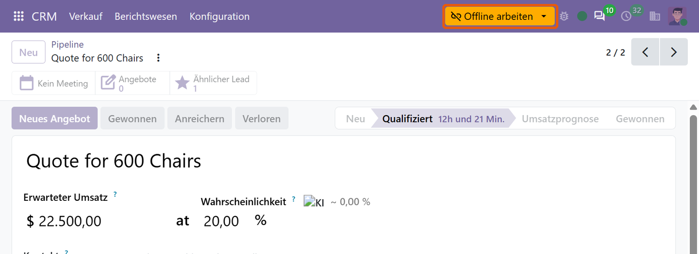
  Screenshot (CE test database): Offline mode on a German user interface — the orange “Offline arbeiten” (working offline) indicator in the top bar while the record stays open; its tooltip lists the changes still waiting to be sent.

- **Simplified access rights** (General) — ir.model.access and ir.rule merge into one ir.access model (group, operation, domain) and security/ir.access.csv; affects every module that ships security files.

  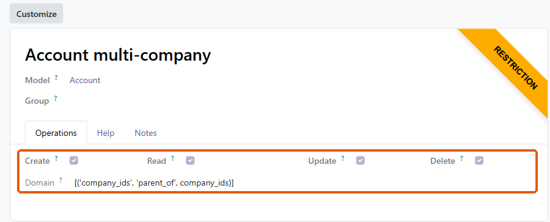
  Screenshot (CE test database): Access right form in developer mode — one record holds model, group, the Create/Read/Update/Delete operations and a domain.

- **Activities** (General) — activities can be assigned to a role (a team) instead of one person, in the redesigned dialogs.

  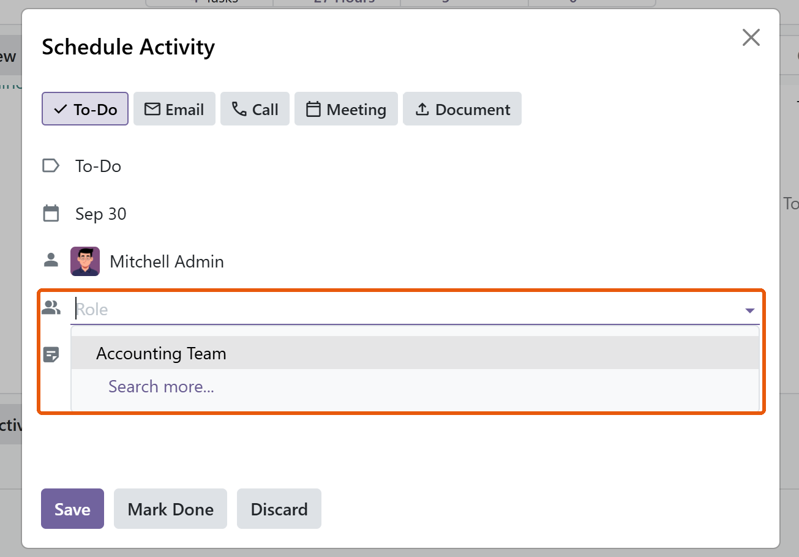
  Screenshot (CE test database): Schedule Activity dialog in the new dialog design — the new “Role” field assigns the activity to a team (here: Accounting Team).

- **Hierarchical view** (Contacts) — a hierarchy view shows companies with their contacts and sub-companies as a tree.

  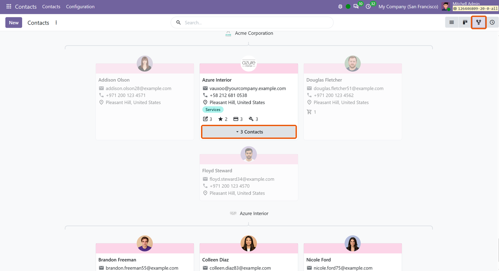
  Screenshot (CE test database): Contacts in the new hierarchy view — a company with its contacts and sub-companies as a tree (Acme Corporation; Azure Interior expands to its 3 contacts). The view is selected with the button top right.

- **Tax included/excluded on orders and invoices** (General) — switch tax-included/excluded prices per sales order, purchase order and invoice.

  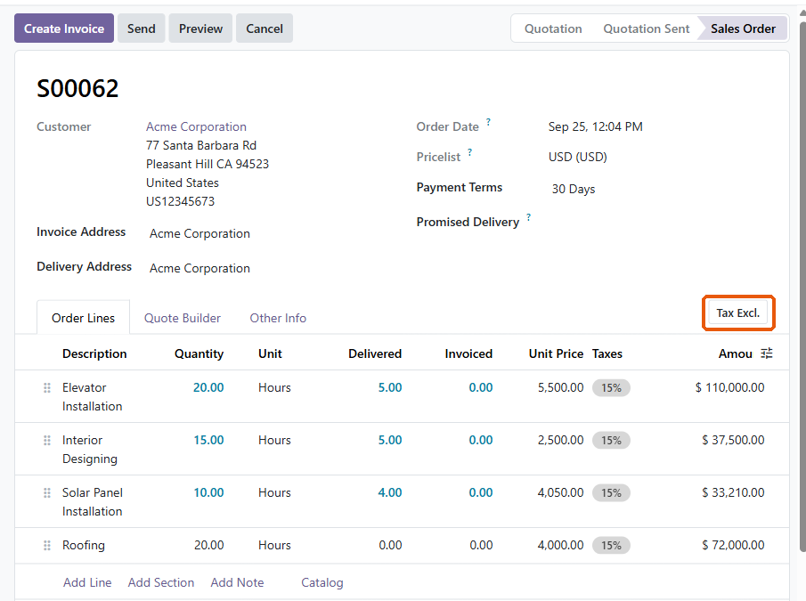
  Screenshot (CE test database): Sales order form — the new “Tax Excl.” switch above the order lines toggles between tax-excluded and tax-included prices.

- **Multiple partner identifiers** (General) — typed, validated partner identifiers (DUNS, national IDs) on the contact form.

  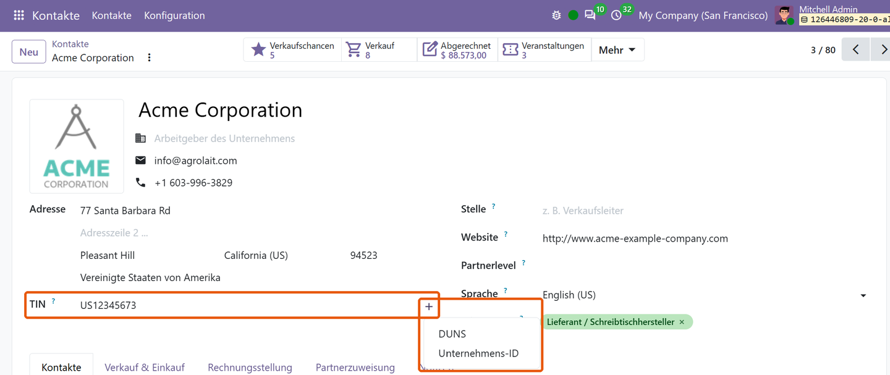
  Screenshot (CE test database): Contact form on a German user interface — the “+” next to the tax ID (TIN) offers further identifier types, here DUNS and company ID (Unternehmens-ID).

- **Translation** (General) — an in-context translation mode (module “Translation Mode”) shows every text on the screen with its translation and links to Weblate; translatable fields can also be imported/exported via CSV/Excel.

  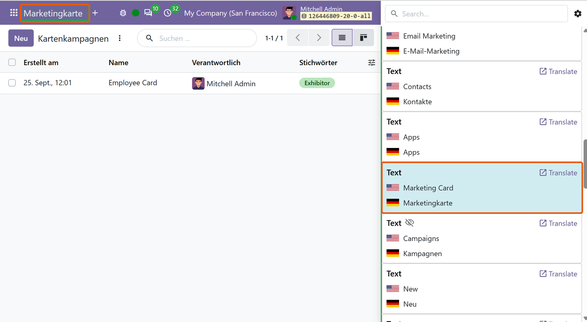
  Screenshot (CE test database): Translation Mode on a German user interface — the side panel lists the texts of the screen (English source, German translation); the highlighted entry is the app title marked on the left, and “Translate” opens the term in Odoo’s Weblate project.

- **Multi-record drag and drop** (General) — reorder or move several records at once in list and Kanban views.

  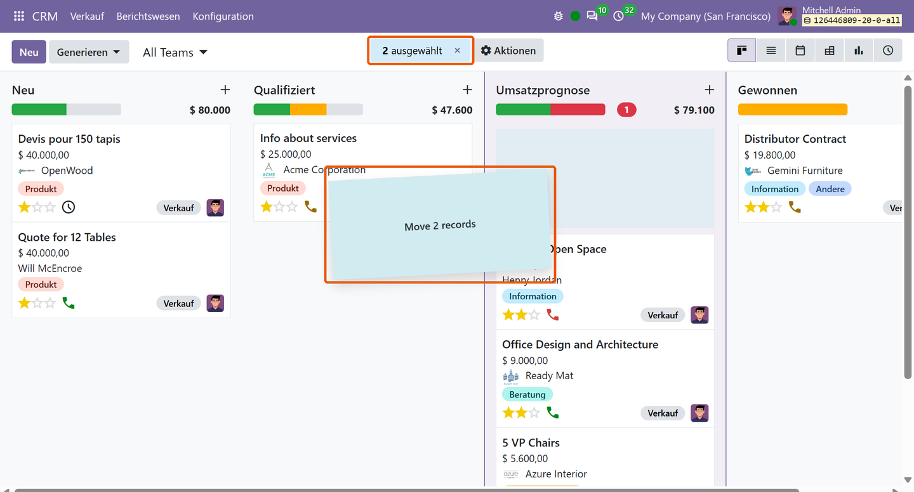
  Screenshot (CE test database): CRM pipeline on a German user interface — two selected opportunities (“2 ausgewählt”) dragged together to another stage; the placeholder reads “Move 2 records”. Select cards with Alt+click (Shift+click for a range).

- **Pin messages in the chatter** (General) — pin, filter and CC in the chatter; activities can be assigned to roles.

  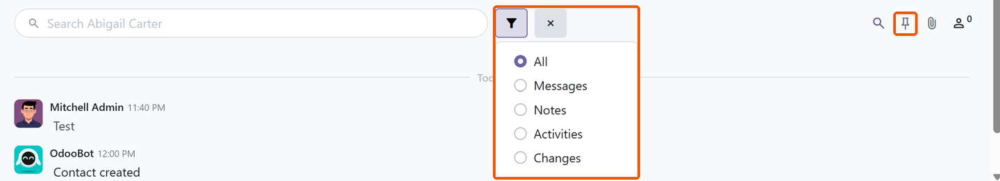
  Screenshot (CE test database): Chatter — the new filter (All / Messages / Notes / Activities / Changes) and the pinned-messages button (pin icon).

- **Polls** (Discuss) — run quick polls inside any Discuss conversation, with emoji options, single or multiple answers and a time limit.

  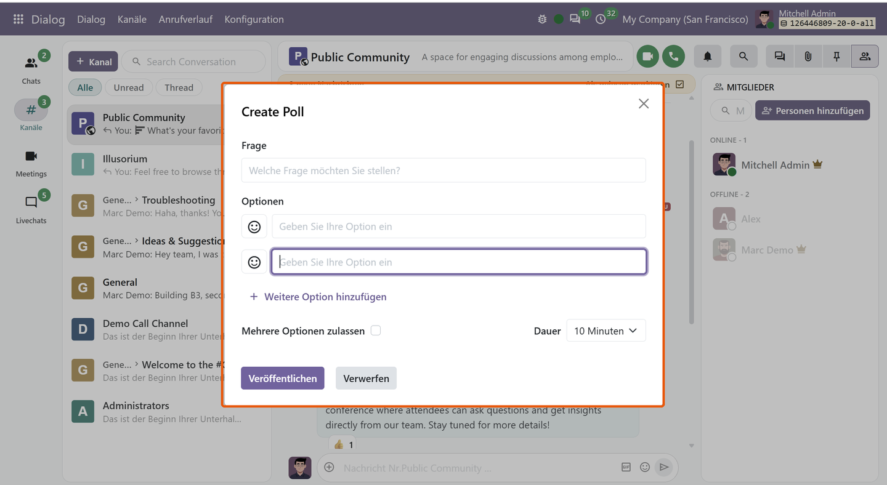
  Screenshot (CE test database): Discuss on a German user interface — the new “Create Poll” dialog: question, options (with emoji), “allow multiple options” and a duration.

- **Multiple calendars in one place** (Calendar) — several calendars per user, shared team calendars, colleagues' calendars and pending activities in one view.

  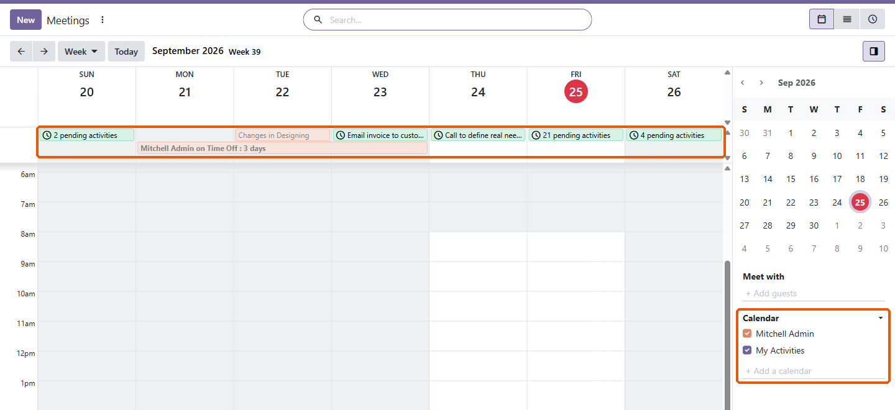
  Screenshot (CE test database): Calendar — “+ Add a calendar” in the side panel for extra or shared calendars, and pending activities in the all-day row.

- **Lead distribution** (CRM) — per salesperson, choose how automatic lead assignment treats them: always in rotation, in rotation with a limit, or out of rotation.

  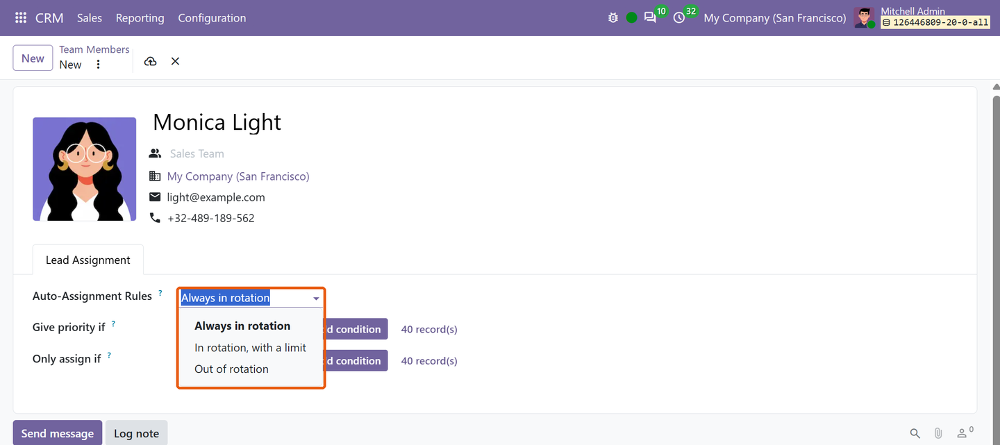
  Screenshot (CE test database): CRM → Configuration → Sales Teams → team member — the new “Auto-Assignment Rules”: Always in rotation, In rotation with a limit, Out of rotation.

- **Parent accounts** (Accounting) — parent accounts replace account groups and account codes become optional — structural change for charts of accounts and reporting modules.

  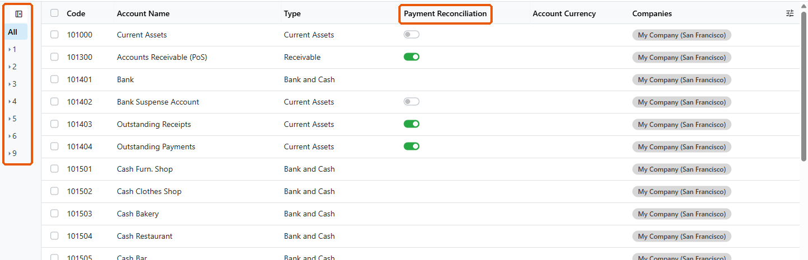
  Screenshot (CE test database): Chart of accounts — the new “Parent Account” column (optional, shown via the column selector). The panel on the left is the existing grouping by code prefix, not the parent accounts.

- **Intuitive payment status** (Accounting) — payment states renamed (In Process → Paid → Reconciled); check custom reports and filters.

  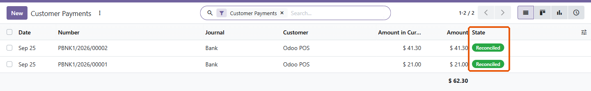
  Screenshot (CE test database): Customer payments — the status column uses the renamed statuses: matched payments show “Reconciled” (formerly “Paid”); payments not yet matched show “Paid” (formerly “In Process”).

- **Employee Expenses menu item** (Accounting) — the separate Employee Expenses menu is gone: approved expenses become draft vendor bills and are handled with the other bills.

  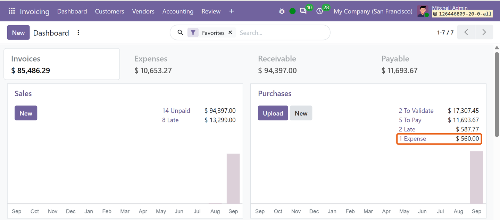
  Screenshot (CE test database): Invoicing dashboard — approved expenses show up with the vendor bills in the Purchases card (“1 Expense”).

- **Withholding tax on payment improvements** (Accounting) — amount due / withhold due / net due split, and pay-only-withholding option in the payment wizard.
- **Dashboard** (Sales) — key figures and quick filters (to confirm, to deliver, to invoice, revenue) on top of the quotations list.

  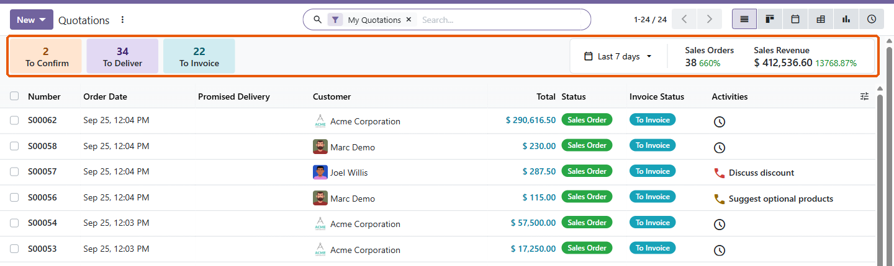
  Screenshot (CE test database): Quotations list — the new dashboard strip with To Confirm / To Deliver / To Invoice filters and revenue for the chosen period.

- **Product images** (Sales) — product images on sales order lines and in the quotation/order PDF.

  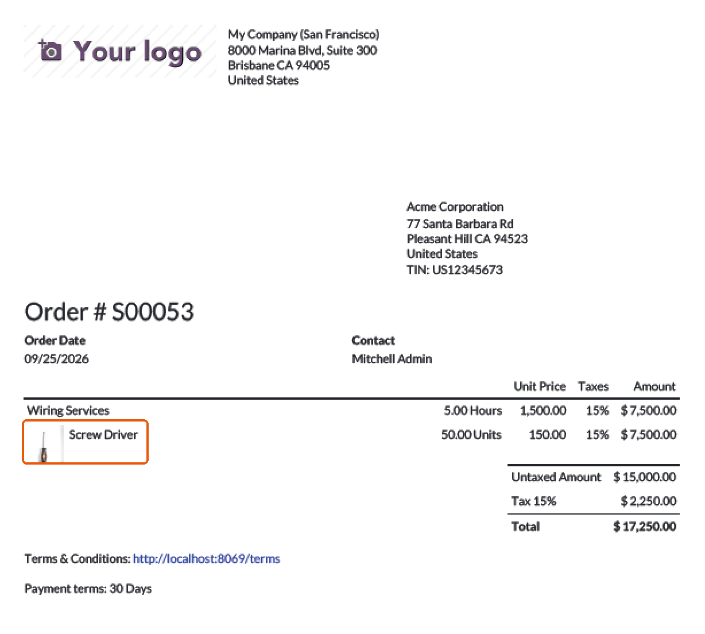
  Screenshot (CE test database): Sales order PDF — the product image is printed next to the order line (here: Screw Driver).

- **Description-only sales order lines** (Sales) — sales order lines no longer need a product (optional "Mandatory Product" setting).

  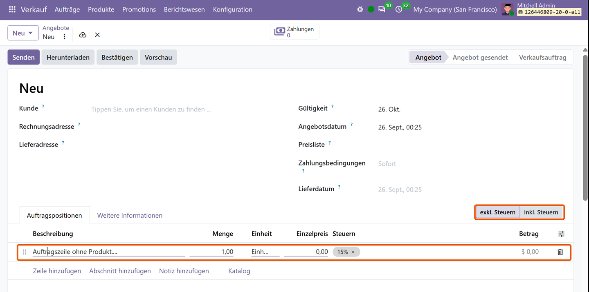
  Screenshot (CE test database): New quotation on a German user interface — an order line with only a description (“Auftragszeile ohne Produkt…”) and no product; above it the tax excluded/included switch (“exkl. Steuern / inkl. Steuern”).

- **Manufacturing order Kanban view** (Manufacturing) — MO Kanban grouped by week with component availability, deadlines and remaining time.

  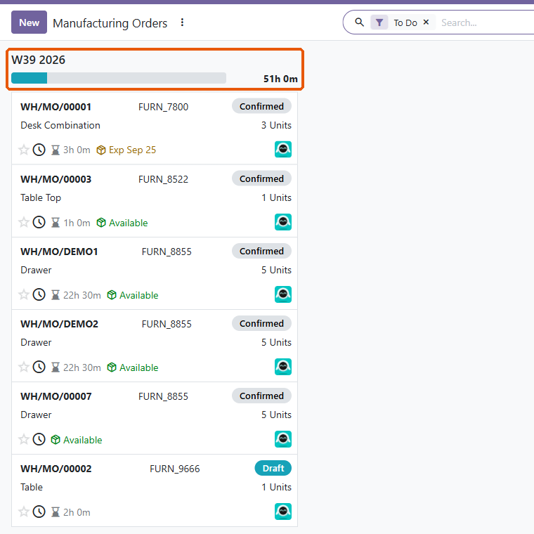
  Screenshot (CE test database): Manufacturing orders Kanban — grouped by week with a workload bar, component availability and remaining time per order.

- **Continuous production** (Manufacturing) — record produced quantities per work order and start the next operations early; MOs can also be split and reset to draft.
- **Product replenishment** (Inventory) — one "Order" button, snooze and automate in the replenishment view; min/max suggestions from demand history.

  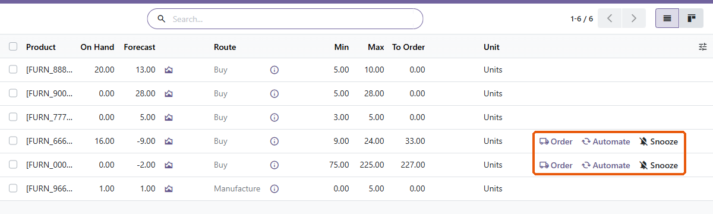
  Screenshot (CE test database): Replenishment — a single “Order” button per line, next to “Automate” and “Snooze”.

- **Multiple currencies** (Point of Sale) — cash and bank payment methods accept several currencies (new “Currencies” field on the payment method); also service fees, snoozed products, simplified receipts and printer selection.

  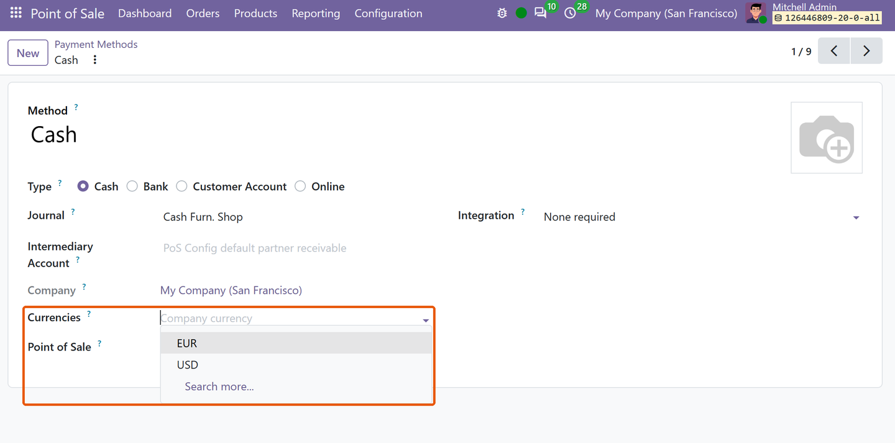
  Screenshot (CE test database): Point of Sale → Configuration → Payment Methods → Cash — the new “Currencies” field (here EUR and USD).

- **Pay on Invoice provider** (Online Payments) — confirm orders without immediate payment; new Toss Payments provider, more Stripe/Mollie methods, wire transfers auto-confirmed from bank transactions.

  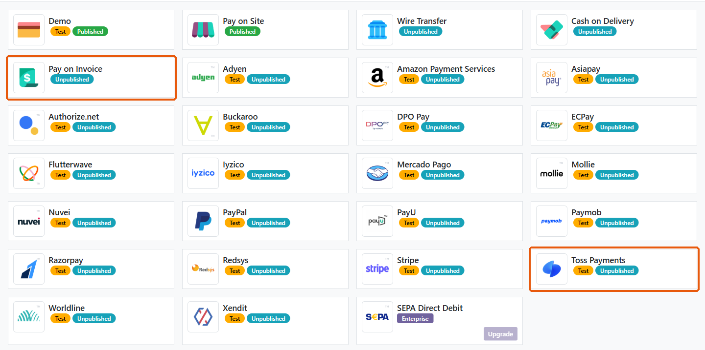
  Screenshot (CE test database): Payment providers — the new “Pay on Invoice” provider (top left) and the new Toss Payments provider (bottom right).

- **llms.txt** (Website) — llms.txt, structured data by default, GTM field, banners, age verification and a reworked website builder.

  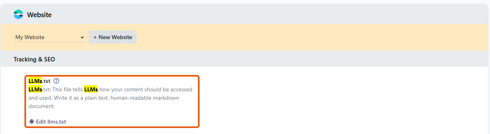
  Screenshot (CE test database): Website settings, Tracking & SEO — the new llms.txt setting with “Edit llms.txt”.

- **Age verification popup** (Website) — a ready-made popup asks visitors to confirm their age and blocks access if they don't.

  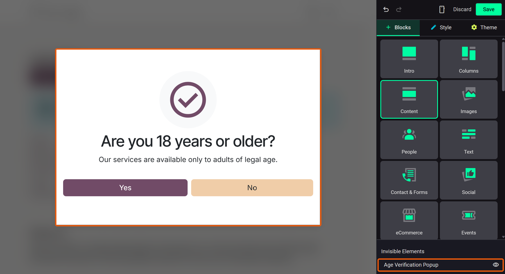
  Screenshot (CE test database): Website editor — the age verification popup (“Are you 18 years or older?”), listed under Invisible Elements.

- **Mail: in-body tracking** (Technical) — tracking values are no longer stored — tracking messages are generated on the fly; affects modules that read mail.tracking.value.

## Déjà vu 😉

Good ideas travel. These Odoo 20 Community features have been around as OCA modules for a while. If you run one of these modules today, check whether you still need it in 20.0 (overlap is not the same as full parity).

| Odoo 20 feature | OCA module | Since | |
|---|---|---|---|
| CC email recipients | [`mail_composer_cc_bcc`](https://github.com/OCA/mail/tree/19.0/mail_composer_cc_bcc) (mail) | 15.0 | CC made it into core. OCA users have been cc'ing since 15.0. |
| Download attachments in bulk / Download invoice attachments | [`attachment_zipped_download`](https://github.com/OCA/knowledge/tree/19.0/attachment_zipped_download) (knowledge) | 14.0 | Zipping attachments in one go — the OCA has been zipping since 14.0. |
| Multiple partner identifiers | [`partner_identification`](https://github.com/OCA/partner-contact/tree/19.0/partner_identification) (partner-contact) | 8.0 | Several typed IDs per partner — the OCA has been counting them since 8.0. Yes, eight. |
| Peppol global location identifiers | [`partner_identification_gln`](https://github.com/OCA/partner-contact/tree/19.0/partner_identification_gln) (partner-contact) | 8.0 | GLN on partners, OCA-style since 8.0. |
| Sales order line numbering | [`sale_order_line_sequence`](https://github.com/OCA/sale-workflow/tree/19.0/sale_order_line_sequence) (sale-workflow) | 9.0 | Line numbers! OCA users have been able to count their order lines since 9.0. |
| Mark orders as fully invoiced | [`sale_force_invoiced`](https://github.com/OCA/sale-workflow/tree/19.0/sale_force_invoiced) (sale-workflow) | 9.0 | "Consider it invoiced" — the OCA has been saying that since 9.0. |
| Product images | [`sale_order_report_product_image`](https://github.com/OCA/sale-reporting/tree/19.0/sale_order_report_product_image) (sale-reporting) | 11.0 | Pictures on quotations — framed by the OCA since 11.0. |
| Default Incoterm per vendor | [`purchase_partner_incoterm`](https://github.com/OCA/purchase-workflow/tree/19.0/purchase_partner_incoterm) (purchase-workflow) | 14.0 | A default Incoterm per vendor has been shipping from the OCA since 14.0. |
| Reset MO to draft | [`mrp_production_back_to_draft`](https://github.com/OCA/manufacture/tree/19.0/mrp_production_back_to_draft) (manufacture) | 14.0 | An undo button for manufacturing orders — OCA since 14.0. |
| Dynamic mailing lists | [`mass_mailing_list_dynamic`](https://github.com/OCA/mass-mailing/tree/19.0/mass_mailing_list_dynamic) (mass-mailing) | 10.0 | Mailing lists that fill themselves — the OCA has been sending them since 10.0. |
| Google Tag Manager (GTM) | [`website_google_tag_manager`](https://github.com/OCA/website/tree/19.0/website_google_tag_manager) (website) | 9.0 | Google Tag Manager in the settings — the OCA has been tagging along since 9.0. |
| Breadcrumbs on static pages | [`website_breadcrumb`](https://github.com/OCA/website/tree/18.0/website_breadcrumb) (website) | 8.0 | The OCA has been leaving breadcrumbs on website pages since 8.0. |
| llms.txt | [`website_llms`](https://github.com/OCA/website/tree/18.0/website_llms) (website) | 16.0 | Talking to LLMs — the OCA module is available from 16.0 on, well ahead of core. |
| Vendor purchase reference | [`stock_picking_supplier_ref`](https://github.com/OCA/stock-logistics-warehouse/tree/18.0/stock_picking_supplier_ref) (stock-logistics-warehouse) | 14.0 | The vendor's reference on the receipt — OCA since 14.0. |
| Return management | [`rma_sale`](https://github.com/OCA/rma/tree/19.0/rma_sale) (rma) | 12.0 | Returns straight from the customer portal — the OCA RMA modules have handled them since 12.0. |
| KPI banner on top of the new Invoicing dashboard (Invoices, Expenses, Receivable, Payable) | [`account_dashboard_banner`](https://github.com/OCA/account-financial-tools/tree/18.0/account_dashboard_banner) (account-financial-tools) | 16.0 | That KPI banner on the new Invoicing dashboard looks familiar — OCA account_dashboard_banner, since 16.0. |

## Heads-up for integrators and module maintainers

Items in Community apps that remove, rename or replace existing behaviour (check your customisations and community modules that extend these areas):

- ✅ **Material Symbols** — Icons switch from Font Awesome to Google Material Symbols.  
  Font Awesome replaced by Material Symbols in the web client — custom views/templates using `fa fa-*` icons need checking; CE `web`; ⚠️ change [H]
- ✅ **Partner autocomplete** — Partner autocomplete no longer turns industry data into partner tags; it stays in the chatter.  
  IAP service; industry no longer written as partner tags; CE `partner_autocomplete`; ⚠️ change IAP backported [M]
- ✅ **Simplified access rights** — Access rights and record rules are unified: an access right can carry a domain that limits which records it applies to.  
  `ir.model.access` and `ir.rule` are replaced by one `ir.access` model (model, group, operation, domain); modules ship `security/ir.access.csv`. Odoo provides `odoo/upgrade_code/19.4-00-ir-access.py` to convert module sources; CE `base`; ⚠️ change [H]
- ✅ **Mail: in-body tracking** — Tracking values are no longer stored; tracking messages are built on the fly. A separate module keeps stored tracking values for those who need them.  
  Tracking values are no longer stored by `mail`; the `mail.tracking.value` model moved to the new optional CE module `mail_tracking` (+ `mail_tracking_mass_mailing`, `mail_tracking_sms`). ⚠️ Same technical names as OCA `mail_tracking` / `mail_tracking_mass_mailing` (OCA/mail 18.0/19.0) — the OCA modules must be renamed for 20.0; CE `mail`, `mail_tracking`; ⚠️ change [H]
- 🟡 **Push notifications** — Push notifications no longer go through Firebase but through Odoo's own push service.  
  Browser web-push is CE; mobile-app push (formerly Firebase/OCN) is EE `mail_mobile`; CE `mail`, `web` · EE `mail_mobile`; ⚠️ change [M]
- ✅ **Employee Expenses menu item** — The separate 'Employee Expenses' menu is gone: approved expenses create draft bills in the expense journal.  
  Standalone 'Employee Expenses' menu removed; approved expenses create draft vendor bills in the expense journal; CE `hr_expense`; ⚠️ change [H]
- ✅ **Intuitive payment status** — Payment statuses renamed ('In Process' → 'Paid', 'Paid' → 'Reconciled'); 'Mark as Reconciled' moved to the action menu.  
  `account.payment.state` values are now draft / paid / reconciled / canceled / rejected; CE `account`; ⚠️ change [H]
- 🟡 **Manual reconciliation** — Manual reconciliation on any account; 'Allow Reconciliation' renamed 'Payment Reconciliation'.  
  Checkbox/logic in CE `account`; bank reconciliation view is EE; CE `account` · EE `account_accountant`; OCA: `account_reconcile_oca` (account-reconcile); ⚠️ change [M]
- ✅ **Parent accounts** — Parent accounts replace account groups to structure the chart of accounts; account codes become optional.  
  `account.group` is gone; `account.account.parent_id` structures the chart and `code` is no longer required; CE `account`; ⚠️ change [H]
- ✅ **Taxes in fiscal positions** — Taxes outside the fiscal position of an invoice are dropped, even without a replacement tax.  
  A product/account default tax outside the invoice's fiscal position is dropped even without a mapping; CE `account`; ⚠️ change [M]
- ✅ **Prevent app use** — Users without Attendances rights can no longer use the app.  
  Users without Attendances rights are blocked from the app; CE `hr_attendance`; ⚠️ change [M]
- ✅ **Remote Work** — Remote Work merged into Employees.  
  `hr_homeworking`, `hr_homeworking_calendar` and `hr_holidays_homeworking` were removed; work locations per weekday now live in `hr`; CE `hr`; ⚠️ change [H]
- ✅ **Simplified returns** — Return wizard removed; simpler returns.  
  The `stock.return.picking` wizard model no longer exists; CE `stock`; ⚠️ change [H]
- ✅ **Bill of materials** — Compare BoMs by quantities, merged status/availability columns, extra costs on the BoM, better component management.  
  BoM overview columns merged, extra-cost field on BoM, BoM comparison; CE `mrp`; ⚠️ change [M]
- ✅ **Flexible consumption** — Flexible consumption setting removed; all MOs consume flexibly.  
  Field `mrp.bom.consumption` removed; consumption is always flexible; CE `mrp`; ⚠️ change [H]
- 🟡 **Produce button** — One 'Produce' button replaces 'Produce' and 'Produce All'.  
  Single Produce button in CE Manufacturing; Shop Floor/Barcode parts EE; CE `mrp` · EE `mrp_workorder`, `stock_barcode_mrp`; ⚠️ change [M]
- ✅ **SOFORT** — SOFORT removed from all providers.  
  The `sofort` payment method record is gone; CE `payment`; ⚠️ change [H]
- ✅ **Employee access levels** — Employee access levels renamed, plus a restrictive 'Supervised' level.  
  POS employee access levels renamed; new restrictive 'Supervised' level; CE `pos_hr`; ⚠️ change [M]
- 🟡 **Profitability report** — Profitability panel removed from the project dashboard; new budget and margin reports.  
  The profitability panel is gone from the project dashboard. Margin reporting stays in CE (`project_account`, `sale_project_margin`); budget analysis needs EE `account_budget`; CE `project_account`, `sale_project_margin`, `project` · EE `account_budget`; OCA: `account_budget_oca` (account-budgeting); ⚠️ change [M]
- ✅ **Repair order status** — The 'Under Repair' status is removed.  
  `repair.order.state` no longer has 'under_repair'; CE `repair`; ⚠️ change [H]
- ✅ **Description-only sales order lines** — Order lines can be description-only; a 'Mandatory Product' setting enforces products.  
  `sale.order.line.product_id` is optional unless the 'Mandatory Product' setting is on; CE `sale`; ⚠️ change [H]
- ✅ **Events, Jobs, and Blog pages** — Standard 'Social Media' and 'Share' snippets in Events/Jobs/Blog sidebars.  
  Sidebar 'Follow Us'/'Share' blocks replaced by standard snippets; CE `website`, `website_event`, `website_blog`, `website_hr_recruitment`; ⚠️ change [M]

### Technical changes for module developers

Mostly not mentioned in Odoo's notes. Where Odoo ships an automatic source rewrite (`odoo/upgrade_code/`), run it on your repository first: `odoo-bin upgrade_code --addons-path=<repo> --from 19.0 --dry-run`.

- **Access rights: ir.access replaces ir.model.access and ir.rule** — The models ir.model.access and ir.rule no longer exist. A single ir.access model holds model, group, operation (e.g. "r", "cru") and an optional domain. Modules ship security/ir.access.csv with columns id,name,model_id,group_id/id,operation,domain instead of ir.model.access.csv + record-rule XML. Script: [`19.4-00-ir-access.py`](https://github.com/odoo/odoo/blob/20.0/odoo/upgrade_code/19.4-00-ir-access.py). *Affects: every module with security files.*
- **Web client moves to OWL 3** — web ships OWL 3.0.0-alpha.49 plus an OWL 2 compatibility layer (web/static/src/owl2/). A large automatic rewrite of JS and templates is provided. Script: [`owl3-migration.py`](https://github.com/odoo/odoo/blob/20.0/odoo/upgrade_code/owl3-migration.py). *Affects: every module with JS/OWL components or QWeb client templates.*
- **QWeb t-call: parameters passed as attributes** — t-set nodes inside t-call bodies are converted into attributes of the t-call (or moved before it when still needed). Xpaths that target t-set inside a t-call may need adapting. Script: [`19.1-00-t-call.py`](https://github.com/odoo/odoo/blob/20.0/odoo/upgrade_code/19.1-00-t-call.py). *Affects: server-side QWeb templates and inheriting xpaths on t-call bodies.*
- **Account groups replaced by parent accounts** — account.group is gone; account.account has parent_id and code is optional. The script converts account group templates of charts of accounts. Script: [`19.3-00-account-groups.py`](https://github.com/odoo/odoo/blob/20.0/odoo/upgrade_code/19.3-00-account-groups.py). *Affects: chart-of-accounts templates (l10n modules), reports on account.group.*
- **Account report XML: foldable lines and shorthand formula engines** — Report-line XML is rewritten (foldable handling, shorthand engine names such as domain/aggregation/tax_tags). Script: [`19.3-00-account-report-foldable.py`](https://github.com/odoo/odoo/blob/20.0/odoo/upgrade_code/19.3-00-account-report-foldable.py). *Affects: modules defining account.report data (tax reports in l10n modules).*
- **XML data: type="base64" file fields become type="bytes"** — <field type="base64" file="..."/> is rewritten to type="bytes". Script: [`19.3-00-base64-in-xml.py`](https://github.com/odoo/odoo/blob/20.0/odoo/upgrade_code/19.3-00-base64-in-xml.py). *Affects: data files loading binary files.*
- **Cache invalidation: registry.clear_cache → transaction.invalidate_ormcache** — Calls to registry.clear_cache(...) are replaced by transaction.invalidate_ormcache(...). Script: [`19.4-00-ormcache-on-transaction.py`](https://github.com/odoo/odoo/blob/20.0/odoo/upgrade_code/19.4-00-ormcache-on-transaction.py). *Affects: Python code clearing ormcaches.*
- **_rec_names_search must be a tuple** — _rec_names_search = ['name'] becomes _rec_names_search = ('name',). Script: [`19.5-00-tuple-rec_names_search.py`](https://github.com/odoo/odoo/blob/20.0/odoo/upgrade_code/19.5-00-tuple-rec_names_search.py). *Affects: models defining _rec_names_search.*
- **Mail tracking values moved to the optional module mail_tracking** — Tracking messages are generated on the fly; mail.tracking.value now comes from the new CE module mail_tracking (not auto-installed). OCA's mail_tracking and mail_tracking_mass_mailing (OCA/mail) clash with the new CE names. *Affects: modules reading mail.tracking.value; OCA/mail modules with the same names.*
- **Font Awesome replaced by Material Symbols** — The web client no longer uses Font Awesome classes in its own templates. *Affects: views, templates and snippets using fa fa-* icon classes.*
- **PDF report engine becomes pluggable (Paper Muncher / wkhtmltopdf)** — New modules base_report_paper_muncher (new "Paper Muncher" engine, not auto-installed) and base_report_wkhtmltox (wkhtmltopdf/wkhtmltoimage engine, auto-installed). *Affects: deployment (Docker images, wkhtmltopdf installs), report customisations.*
- **Modules merged into core modules** — e.g. base_vat → base (+ l10n_eu_account_vies for VIES), stock_picking_batch → stock, website_sale_wishlist / website_sale_comparison → website_sale, hr_org_chart / hr_hourly_cost / hr_homeworking → hr, purchase_requisition_sale → purchase_alternative_sale. Full list in module-changes-20.0.yaml. *Affects: depends lists of community modules (e.g. OCA).*

### Module-level changes in Community (not in the official notes)

Diff of the CE module list (odoo/odoo 19.0 vs 20.0 (addons/), GitHub, 2026-09-25). Not part of Odoo's release notes, but it matters for every migration: `depends` in OCA modules must follow merged modules.

**⚠️ Name collisions with OCA modules** — new CE modules with the same technical name as existing OCA modules; the OCA modules cannot be migrated to 20.0 under their current name:

- `mail_tracking` (Discuss Tracking) ↔ OCA mail@18.0, mail@19.0
- `mail_tracking_mass_mailing` (Mass Mailing Tracking) ↔ OCA mail@18.0, mail@19.0

**Removed or merged CE modules (49)**

| Module (19.0) | Now in / status | OCA modules building on it |
|---|---|---|
| `account_add_gln` | account / account_edi_ubl_cii — GLN on partners | — |
| `account_peppol_advanced_fields` | to check | — |
| `account_peppol_response` | account_peppol | — |
| `base_iban` | base, account — IBAN handling in res.partner.bank (base/account) | — |
| `base_vat` | base, l10n_eu_account_vies — VAT check in base; VIES validation in new l10n_eu_account_vies | — |
| `delivery_mondialrelay` | (removed; EE delivery_sendcloud) | — |
| `delivery_stock_picking_batch` | stock_delivery | — |
| `hr_holidays_homeworking` | hr / hr_holidays | — |
| `hr_homeworking` | hr — hr.employee.location + weekday locations now in hr | — |
| `hr_homeworking_calendar` | hr | — |
| `hr_hourly_cost` | hr — hourly_cost field now in hr | — |
| `hr_org_chart` | hr — org chart controller now in hr | — |
| `hr_work_entry_holidays` | to check | — |
| `iot_base` | to check | — |
| `iot_box_image` | to check | — |
| `l10n_cn_city` | to check | — |
| `l10n_dk_nemhandel` | to check | — |
| `l10n_dk_nemhandel_response` | to check | — |
| `l10n_dk_oioubl` | to check | — |
| `l10n_ec_stock` | to check | — |
| `l10n_fr_hr_work_entry_holidays` | to check | — |
| `l10n_hu_edi_receive` | to check | — |
| `l10n_latam_base` | to check | — |
| `l10n_lk_invoice` | to check | — |
| `l10n_pl_bank_verification` | to check | — |
| `l10n_ro_cpv_code` | to check | — |
| `l10n_ro_edi_stock_batch` | to check | — |
| `l10n_sa_withholding_tax` | to check | — |
| `l10n_tr_nilvera` | moved to Enterprise — present in EE 20.0 tarball as OEEL | — |
| `l10n_tr_nilvera_base_vat` | to check | — |
| `l10n_tr_nilvera_edispatch` | moved to Enterprise | — |
| `l10n_tr_nilvera_einvoice` | moved to Enterprise | — |
| `l10n_tr_nilvera_einvoice_extended` | to check | — |
| `l10n_uy_pos` | to check | — |
| `pos_restaurant_adyen` | pos_adyen | — |
| `pos_restaurant_stripe` | to check | — |
| `pos_self_order_adyen` | to check | — |
| `pos_self_order_stripe` | to check | — |
| `pos_self_order_viva_com` | to check | — |
| `purchase_requisition_sale` | purchase_alternative_sale | — |
| `stock_picking_batch` | stock — stock.picking.batch model now defined in stock | `stock_picking_batch_account`, `stock_picking_batch_account_sale_type`, `stock_picking_batch_creation`, `stock_picking_batch_creation_split_kit` |
| `transifex` | (removed; translations via Weblate) | — |
| `website_sale_autocomplete` | website_address_autocomplete | — |
| `website_sale_collect_wishlist` | website_sale | — |
| `website_sale_comparison` | website_sale | `website_sale_comparison_hide_price`, `website_sale_comparison_specification_variant` |
| `website_sale_comparison_wishlist` | website_sale | — |
| `website_sale_mondialrelay` | (removed; EE delivery_sendcloud) | — |
| `website_sale_stock_wishlist` | website_sale | — |
| `website_sale_wishlist` | website_sale — product.wishlist model now in website_sale | `website_sale_wishlist_hide_price`, `website_sale_wishlist_keep` |

**New CE modules (51)**: `account_payment_custom`, `base_report_paper_muncher`*, `base_report_wkhtmltox`, `crm_sale_project`, `fleet_maintenance`, `hr_address_extended`*, `hr_calendar_google`, `iot_webserial`*, `l10n_be_pos`, `l10n_eg_edi_pos`, `l10n_es_website_sale`*, `l10n_eu_account_vies`*, `l10n_fr_payment`, `l10n_gr_edi_delivery_note`, `l10n_id_pos_self_order_qris`, `l10n_in_boe`*, `l10n_kr_sale`, `l10n_mk`*, `l10n_mm`*, `l10n_ph_invoice`*, `l10n_ph_sale`*, `l10n_pk_edi`*, `l10n_pk_edi_pos`*, `l10n_tw_edi_ecpay_sale`, `l10n_vn_edi_viettel_stock`, `mail_tracking`*, `mail_tracking_mass_mailing`, `mail_tracking_sms`, `marketing_card_event`, `mrp_delivery`, `mysubscription`, `populate`*, `portal_discuss`, `pos_bancontact_pay`*, `pos_partner_autocomplete`, `pos_sale_delivery`, `pos_sale_stock`, `pos_self_order_bancontact_pay`, `pos_self_order_event`, `pos_self_order_sms`, `pos_stock`, `printer`*, `purchase_alternative`*, `purchase_alternative_sale`, `purchase_alternative_stock`, `sale_project_margin`, `test_translation_mode`*, `website_address_autocomplete`, `website_mass_mailing_event`, `website_partnership`*, `website_sale_project`  
* = not auto-installed

## Overview per app

| App | ✅ | 🟡 | 🔒 | Total |
|---|---:|---:|---:|---:|
| [General](#general) | 36 | 2 | 3 | 41 |
| [Technical](#technical) | 4 | 1 | 0 | 5 |
| [Industries](#industries) | 0 | 0 | 25 | 25 |
| [Accounting](#accounting) | 22 | 6 | 17 | 45 |
| [Localizations](#localizations) | 10 | 41 | 4 | 55 |
| [AI](#ai) | 0 | 0 | 20 | 20 |
| [Appointments](#appointments) | 0 | 0 | 19 | 19 |
| [Appraisals](#appraisals) | 0 | 0 | 4 | 4 |
| [Attendances](#attendances) | 6 | 0 | 0 | 6 |
| [Barcode](#barcode) | 1 | 1 | 10 | 12 |
| [Blog](#blog) | 3 | 0 | 0 | 3 |
| [Calendar](#calendar) | 9 | 0 | 2 | 11 |
| [Contacts](#contacts) | 2 | 0 | 0 | 2 |
| [CRM](#crm) | 4 | 0 | 1 | 5 |
| [Dashboards](#dashboards) | 5 | 1 | 1 | 7 |
| [Discuss](#discuss) | 4 | 1 | 1 | 6 |
| [Documents](#documents) | 0 | 0 | 9 | 9 |
| [eCommerce](#ecommerce) | 34 | 1 | 3 | 38 |
| [eLearning](#elearning) | 1 | 0 | 0 | 1 |
| [Email Marketing](#email-marketing) | 14 | 0 | 0 | 14 |
| [Employees](#employees) | 3 | 0 | 1 | 4 |
| [ESG](#esg) | 0 | 0 | 1 | 1 |
| [Events](#events) | 1 | 0 | 0 | 1 |
| [Expenses](#expenses) | 2 | 0 | 1 | 3 |
| [Field Service](#field-service) | 0 | 0 | 1 | 1 |
| [Fleet](#fleet) | 0 | 0 | 1 | 1 |
| [Frontdesk](#frontdesk) | 0 | 0 | 1 | 1 |
| [Helpdesk](#helpdesk) | 0 | 0 | 3 | 3 |
| [Inventory](#inventory) | 19 | 0 | 3 | 22 |
| [Knowledge](#knowledge) | 0 | 0 | 1 | 1 |
| [Live Chat](#live-chat) | 0 | 0 | 1 | 1 |
| [Maintenance](#maintenance) | 2 | 0 | 1 | 3 |
| [Manufacturing](#manufacturing) | 20 | 2 | 2 | 24 |
| [Marketing Automation](#marketing-automation) | 0 | 0 | 6 | 6 |
| [Marketing Card](#marketing-card) | 3 | 0 | 0 | 3 |
| [Online Payments](#online-payments) | 16 | 0 | 0 | 16 |
| [Payroll](#payroll) | 0 | 0 | 15 | 15 |
| [Phone](#phone) | 0 | 0 | 10 | 10 |
| [Planning](#planning) | 0 | 0 | 20 | 20 |
| [PLM](#plm) | 0 | 0 | 4 | 4 |
| [Point of Sale](#point-of-sale) | 16 | 1 | 3 | 20 |
| [Project](#project) | 6 | 1 | 1 | 8 |
| [Purchase](#purchase) | 8 | 0 | 1 | 9 |
| [Quality](#quality) | 0 | 0 | 2 | 2 |
| [Recruitment](#recruitment) | 4 | 0 | 0 | 4 |
| [Referrals](#referrals) | 0 | 0 | 1 | 1 |
| [Rental](#rental) | 0 | 0 | 6 | 6 |
| [Repairs](#repairs) | 3 | 0 | 0 | 3 |
| [Sales](#sales) | 23 | 0 | 4 | 27 |
| [Shop Floor](#shop-floor) | 0 | 0 | 3 | 3 |
| [Sign](#sign) | 0 | 0 | 15 | 15 |
| [Social Marketing](#social-marketing) | 0 | 0 | 7 | 7 |
| [Spreadsheet](#spreadsheet) | 0 | 30 | 0 | 30 |
| [Studio](#studio) | 1 | 0 | 8 | 9 |
| [Subscriptions](#subscriptions) | 0 | 0 | 1 | 1 |
| [Time Off](#time-off) | 4 | 0 | 0 | 4 |
| [Timesheets](#timesheets) | 0 | 0 | 5 | 5 |
| [Website](#website) | 55 | 2 | 3 | 60 |
| [WhatsApp](#whatsapp) | 0 | 0 | 5 | 5 |

## Community and mixed apps

### General

[Official section](https://www.odoo.com/odoo-20-release-notes#table_of_content_heading_1_18) · 36 ✅ · 2 🟡 · 3 🔒

- ✅ **Activities** — Activities can be assigned to a role instead of a person; the Schedule Activity dialog and chatter got UX improvements, and meeting activities show more context.  
  CE `mail`; [H]
- ✅ **Calendar view side panel** — In calendar views with scheduling enabled, drag records into the side panel to unschedule them.  
  Calendar view side panel (CE web); 'Scheduling' option of Gantt is EE; CE `web`; [M]
- ✅ **CC email recipients** — Add CC recipients when sending emails; the chatter shows who was in CC.  
  CE `mail`; 😉 déjà vu: OCA [`mail_composer_cc_bcc`](https://github.com/OCA/mail/tree/19.0/mail_composer_cc_bcc) since 15.0; [M]
- ✅ **Chatter filter** — Filter the chatter to show only messages or only tracked changes.  
  CE `mail`; [H]
- ✅ **Currency aggregates: date** — When totals are converted to another currency, the date of the exchange rate used is shown.  
  CE `web`; [M]
- ✅ **Decimal separator** — Both dot and comma are accepted as decimal separator when typing numbers, whatever the user's language.  
  CE `web`, `base`; [M]
- ✅ **Dialog design** — Redesigned dialogs.  
  CE `web`; [H]
- ✅ **Digest email KPIs** — More KPIs available in the periodic digest emails.  
  CE `digest`; [M]
- ✅ **Download attachments in bulk** — Download many attachments at once from the Technical menu, across models and records.  
  CE `base`, `web`; 😉 déjà vu: OCA [`attachment_zipped_download`](https://github.com/OCA/knowledge/tree/19.0/attachment_zipped_download) since 14.0; [M]
- ✅ **Email template preview** — Better email template preview, with navigation between sample records.  
  CE `mail`; [M]
- ✅ **Favorited searches** — Saved favourite searches in list views remember the visible columns.  
  CE `web`; [M]
- ✅ **File sharing on mobiles** — Share files from a phone to Odoo (e.g. a bill, expense receipt) to create records such as bills, expenses, tasks, leads, to-dos or time off.  
  PWA share-target is CE; OCR digitization of bills/expenses is EE (`*_extract`); CE `web`, `account`, `hr_expense`, `project`; [H]
- ✅ **Import product variants** — Import products with one line per variant, including attribute values, cost and on-hand quantity.  
  CE `base_import`, `product`; backported [M]
- ✅ **Incremental edits on duration fields** — Type +=, -=, *= or /= in duration fields to adjust the current value (e.g. +=2 adds two hours).  
  CE `web`; [M]
- ✅ **Label design** — Redesigned product, manufacturing and packaging labels.  
  CE `product`, `stock`, `mrp`; [M]
- ✅ **Link previews** — Links to an Odoo website shared on social platforms show a preview card.  
  CE `website`, `mail`; [M]
- ✅ **Link to current search** — Share a link to the current view that keeps filters, search and grouping.  
  CE `web`; [M]
- ✅ **List view: expand/collapse groups** — Alt+click expands or collapses all groups of the same level in list views.  
  CE `web`; [M]
- ✅ **Material Symbols** — Icons switch from Font Awesome to Google Material Symbols.  
  Font Awesome replaced by Material Symbols in the web client — custom views/templates using `fa fa-*` icons need checking; CE `web`; ⚠️ change [H]
- ✅ **Multi-record drag and drop** — Drag and drop several selected records at once in list and Kanban views.  
  CE `web`; [H]
- ✅ **Multiple partner identifiers** — Store several typed, validated identifiers per partner (e.g. DUNS or national IDs).  
  Multi-ID on the contact form is CE (`base`); identifier schemes for e-invoicing in `account_edi_ubl_cii`; CE `base`, `account`; 😉 déjà vu: OCA [`partner_identification`](https://github.com/OCA/partner-contact/tree/19.0/partner_identification) since 8.0; [H]
- ✅ **My Subscription page** — New 'My Subscription' page in the user menu with plan, IAP services and database management.  
  Module is LGPL in CE but only meaningful for databases with an odoo.com subscription; CE `mysubscription`; IAP [M]
- ✅ **Offline mode** — Create, edit, archive and delete records while offline, and re-run earlier searches.  
  CE `web`; [H]
- ✅ **Partner autocomplete** — Partner autocomplete no longer turns industry data into partner tags; it stays in the chatter.  
  IAP service; industry no longer written as partner tags; CE `partner_autocomplete`; ⚠️ change IAP backported [M]
- ✅ **Pin messages in the chatter** — Pin important messages in the chatter.  
  CE `mail`; [H]
- ✅ **Portal layout** — Portal users can reorder the cards on their portal home.  
  CE `portal`; [M]
- ✅ **Record deletion** — When a record cannot be deleted, Odoo offers to archive it instead.  
  CE `web`; [M]
- ✅ **Relative range tooltip** — Relative date filters (e.g. 'Last 30 days') show the actual dates in a tooltip.  
  CE `web`; [M]
- ✅ **Rich-text editor** — Simplified media toolbar in the rich-text editor.  
  CE `html_editor`; [M]
- ✅ **Product catalog: units of measure** — Choose the unit or packaging when adding products from the catalog.  
  CE `product`; [M]
- ✅ **Simplified access rights** — Access rights and record rules are unified: an access right can carry a domain that limits which records it applies to.  
  `ir.model.access` and `ir.rule` are replaced by one `ir.access` model (model, group, operation, domain); modules ship `security/ir.access.csv`. Odoo provides `odoo/upgrade_code/19.4-00-ir-access.py` to convert module sources; CE `base`; ⚠️ change [H]
- ✅ **Tablets: bottom sheets** — Bottom sheets (panels sliding up from the bottom) also on tablets in touch mode.  
  CE `web`; [M]
- ✅ **Tax included/excluded on orders and invoices** — Switch between tax-included and tax-excluded prices on sales orders, purchase orders and invoices; taxes can override the setting.  
  CE `account`, `sale`, `purchase`; [H]
- ✅ **Text messages** — Schedule text messages and use dynamic placeholders in SMS templates.  
  CE `sms`; [M]
- ✅ **Translation** — Optional in-context 'Translation Mode' (via command palette) to translate modules with Weblate; import/export of translatable fields in several languages via CSV/Excel.  
  Shipped as CE module `test_translation_mode` (sic) — install it to get the translation mode; CE `test_translation_mode`, `web`; [H]
- ✅ **Translation wizard** — New wizard to translate text and HTML fields.  
  CE `web`; [M]
- 🟡 **Mail plugins** — Gmail/Outlook plugins: search contacts, tasks or helpdesk tickets and log emails on them; pick recipients in multi-person threads.  
  Plugin backend for contacts/leads/tasks is CE; helpdesk tickets need EE Helpdesk; CE `mail_plugin`, `crm_mail_plugin`, `project_mail_plugin` · EE `helpdesk_mail_plugin`; OCA: `helpdesk_mgmt` (helpdesk); [M]
- 🟡 **Mobile** — Mobile: swipe down on the home screen for the command palette, date picker in a bottom sheet, better touch forms, new secure login screen.  
  Home-menu dashboard & mobile app login are EE (`web_enterprise`/mobile app); bottom-sheet date picker & touch forms are CE `web`; CE `web` · EE `web_enterprise`; OCA: `web_responsive` (web); [M]
- 🔒 **Gantt view** — Select a whole row/column in Gantt views, start/end buffers, and schedule/unschedule via a side panel (Studio option).  
  Gantt view is EE-only (`web_gantt`). OCA: web_timeline / project_timeline; EE `web_gantt`; [M]
- 🔒 **Map view: unlocated records** — Map view shows records without an address so they can be opened and fixed.  
  Map view is EE-only (`web_map`). OCA: web_view_leaflet_map; EE `web_map`; [M]
- 🔒 **Sendcloud shipping labels** — Choose PDF, ZPL or PNG for Sendcloud shipping labels.  
  Sendcloud connector is EE. OCA: delivery-carrier repo; EE `delivery_sendcloud`; [M]

### Technical

[Official section](https://www.odoo.com/odoo-20-release-notes#table_of_content_heading_1_77) · 4 ✅ · 1 🟡 · 0 🔒

- ✅ **Mail: in-body tracking** — Tracking values are no longer stored; tracking messages are built on the fly. A separate module keeps stored tracking values for those who need them.  
  Tracking values are no longer stored by `mail`; the `mail.tracking.value` model moved to the new optional CE module `mail_tracking` (+ `mail_tracking_mass_mailing`, `mail_tracking_sms`). ⚠️ Same technical names as OCA `mail_tracking` / `mail_tracking_mass_mailing` (OCA/mail 18.0/19.0) — the OCA modules must be renamed for 20.0; CE `mail`, `mail_tracking`; ⚠️ change [H]
- ✅ **Many-to-one field improvements** — Many2one fields sync with the server and handle adding/removing values better, also with large lists.  
  CE `web`; [M]
- ✅ **Track source of postings** — Outgoing mail records record where their content came from, for auditing.  
  CE `mail`; [M]
- ✅ **Tracking user group changes** — Changes to a user's groups are logged in the user's chatter and in the server log.  
  CE `base`; [M]
- 🟡 **Push notifications** — Push notifications no longer go through Firebase but through Odoo's own push service.  
  Browser web-push is CE; mobile-app push (formerly Firebase/OCN) is EE `mail_mobile`; CE `mail`, `web` · EE `mail_mobile`; ⚠️ change [M]

### Accounting

[Official section](https://www.odoo.com/odoo-20-release-notes#table_of_content_heading_1_79) · 22 ✅ · 6 🟡 · 17 🔒

- ✅ **Accounting Firms mode settings** — More flexible 'Accounting Firms mode' settings.  
  CE `account`; [M]
- ✅ **Bill/invoice matching rules** — 'Matching Rules' define payment tolerance and matching order for automatic bill/invoice reconciliation.  
  CE `account`; [M]
- ✅ **Cash journal entry hashing** — Cash journals can be secured with entry hashing on reconciliation.  
  CE `account`; [H]
- ✅ **Conversion rates** — Conversion rates are shown when registering foreign-currency payments.  
  CE `account`; [M]
- ✅ **Download invoice attachments** — Download a zip with all generated attachments (PDF, XML…) of selected invoices.  
  CE `account`; 😉 déjà vu: OCA [`attachment_zipped_download`](https://github.com/OCA/knowledge/tree/19.0/attachment_zipped_download) since 14.0; [L]
- ✅ **Employee Expenses menu item** — The separate 'Employee Expenses' menu is gone: approved expenses create draft bills in the expense journal.  
  Standalone 'Employee Expenses' menu removed; approved expenses create draft vendor bills in the expense journal; CE `hr_expense`; ⚠️ change [H]
- ✅ **Exchange entries** — Exchange differences are grouped into one line per invoice, with expandable details.  
  CE `account`; [M]
- ✅ **Improved duplicate detection** — Two-level duplicate warnings on invoices and bills (red: likely duplicate, yellow: check).  
  CE `account`; backported [M]
- ✅ **Intuitive payment status** — Payment statuses renamed ('In Process' → 'Paid', 'Paid' → 'Reconciled'); 'Mark as Reconciled' moved to the action menu.  
  `account.payment.state` values are now draft / paid / reconciled / canceled / rejected; CE `account`; ⚠️ change [H]
- ✅ **Inventory valuation** — Accrual entries (bills to receive, billed not received, etc.) can be created from the inventory valuation closing report.  
  Accrual actions (Bills To Receive, Billed Not Received…) are in CE purchase/account; CE `purchase`, `account`, `stock_account`; [M]
- ✅ **Multiple invoice details** — When sending several invoices at once, the dialog shows how each will be sent.  
  CE `account`; [M]
- ✅ **New currency: Caribbean Guilder** — Caribbean Guilder (XCG) added and set as default currency for Curaçao and Sint Maarten.  
  CE `base`; backported [H]
- ✅ **Parent accounts** — Parent accounts replace account groups to structure the chart of accounts; account codes become optional.  
  `account.group` is gone; `account.account.parent_id` structures the chart and `code` is no longer required; CE `account`; ⚠️ change [H]
- ✅ **Peppol global location identifiers** — Add GLN location identifiers to delivery contacts for Peppol.  
  CE `account_edi_ubl_cii`, `account_peppol`; 😉 déjà vu: OCA [`partner_identification_gln`](https://github.com/OCA/partner-contact/tree/19.0/partner_identification_gln) since 8.0; backported [H]
- ✅ **Prevent double payments in the payment wizard** — The payment wizard deducts pending payments to avoid paying twice, and sorts outstanding payments by date.  
  CE `account`; [M]
- ✅ **Professional percentage for receipts** — The 'Professional' percentage column also exists on purchase receipts.  
  CE `account`; backported [M]
- ✅ **Purchase order matching** — Better bill-to-PO matching: auto-complete checks existing lines first, shows a summary, warns on price/quantity differences, and allows unmatching.  
  CE `purchase`, `account`; [H]
- ✅ **Reset to Draft action in list views** — 'Reset to Draft' as a batch action in any journal entry list.  
  CE `account`; [M]
- ✅ **Split items on invoices** — Split selected journal items of an invoice, e.g. across quantities, assets or accounts.  
  CE `account`; [L]
- ✅ **Taxes in fiscal positions** — Taxes outside the fiscal position of an invoice are dropped, even without a replacement tax.  
  A product/account default tax outside the invoice's fiscal position is dropped even without a mapping; CE `account`; ⚠️ change [M]
- ✅ **Valuation without Inventory** — Track stock on hand and valuation without installing Inventory.  
  CE `stock_account`, `account`; [L]
- ✅ **Withholding tax on payment improvements** — Bills with withholding tax show amount due, withholding due and net due; the payment wizard can pay either part or both.  
  CE `l10n_account_withholding_tax`; [M]
- 🟡 **Bank consistency** — Journal entries on bank accounts must come from bank transactions; clearer feedback on statement balance inconsistencies.  
  CE `account` · EE `account_accountant`; OCA: `account_reconcile_oca` (account-reconcile); [L]
- 🟡 **Bill options display** — Bill line options (depreciation model, vehicle, deferral) are stacked under the account.  
  CE `account` · EE `account_asset`, `account_accountant`; OCA: `account_asset_management` (account-financial-tools), `account_reconcile_oca` (account-reconcile); [L]
- 🟡 **Customer invoice reminders** — Send invoice reminders manually from the invoice list or form; automatic reminders configurable in settings.  
  Invoice reminder sending in CE `account`; follow-up levels/automation EE; CE `account` · EE `account_followup`; OCA: `account_credit_control` (credit-control); [M]
- 🟡 **Invoice email attachments** — Add files from Documents or earlier chatter attachments when emailing an invoice.  
  Chatter attachments CE; Documents-app files EE; CE `account` · EE `documents_account`; backported [M]
- 🟡 **Manual reconciliation** — Manual reconciliation on any account; 'Allow Reconciliation' renamed 'Payment Reconciliation'.  
  Checkbox/logic in CE `account`; bank reconciliation view is EE; CE `account` · EE `account_accountant`; OCA: `account_reconcile_oca` (account-reconcile); ⚠️ change [M]
- 🟡 **Onboarding improvements** — Easier accounting onboarding for e-invoicing and tax setup.  
  CE `account` · EE `account_accountant`; OCA: `account_reconcile_oca` (account-reconcile); [L]
- 🔒 **Analytic distribution for write-offs** — Set an analytic distribution on write-offs during reconciliation.  
  `account.reconcile.wizard` (write-off) lives in EE `account_accountant`; EE `account_accountant`; OCA: `account_reconcile_oca` (account-reconcile); [H]
- 🔒 **Annual report layout** — Annual reports use the company's document layout.  
  Annual/financial reports are EE (`account_reports`). OCA: account_financial_report, mis_builder; EE `account_reports`; [M]
- 🔒 **Asset depreciation** — Depreciation accepts rates and decimal numbers.  
  OCA: account_asset_management; EE `account_asset`; [M]
- 🔒 **Bank reconciliation summary report** — New bank reconciliation summary report (reconciled vs unreconciled at period end).  
  EE `account_reports`; OCA: `account_financial_report` (account-financial-reporting), `mis_builder` (mis-builder); [M]
- 🔒 **Bank synchronization: Syncfy** — Syncfy added as bank synchronization provider for Latin America.  
  Bank synchronization is an Odoo-hosted service (no bank-sync module in the 20.0 source tarball). OCA: bank-statement-import; [M]
- 🔒 **Bill line prediction** — When encoding a bill, product, account, taxes, analytics and vehicle are suggested from bill history and the label.  
  Line prediction (`_predict_*`) is in EE `account_accountant`; EE `account_accountant`; OCA: `account_reconcile_oca` (account-reconcile); [M]
- 🔒 **Cumulative Translation Adjustment (CTA)** — Auditable Cumulative Translation Adjustment (CTA) line in balance sheet, trial balance and general ledger.  
  EE `account_reports`; OCA: `account_financial_report` (account-financial-reporting), `mis_builder` (mis-builder); [M]
- 🔒 **Currency exchange rate providers** — New automatic currency rate providers: Azerbaijan, Georgia, Kazakhstan, Saudi Arabia, Uzbekistan.  
  OCA: currency_rate_update; EE `currency_rate_live`; backported [M]
- 🔒 **Intercompany purchase order matching** — Synchronised inter-company vendor bills are matched with the synchronised purchase orders.  
  EE `account_inter_company_rules`; [L]
- 🔒 **Multi-ledger consolidation** — Multi-ledger consolidation now includes (rather than excludes) journals.  
  EE `account_reports`; OCA: `account_financial_report` (account-financial-reporting), `mis_builder` (mis-builder); [M]
- 🔒 **Optimized data entry** — Faster bank statement encoding with reconciliation-model shortcuts and transaction batching.  
  EE `account_accountant`; OCA: `account_reconcile_oca` (account-reconcile); [M]
- 🔒 **PAIN version setting** — The PAIN (ISO 20022) version is set per payment method instead of per journal.  
  PAIN/ISO20022 payment files are EE (`account_iso20022`). OCA: account_banking_sepa_credit_transfer (bank-payment); EE `account_iso20022`; [H]
- 🔒 **Pay bills from Odoo** — Pay bills (single or batch) from Odoo with one signature via payment initiation (PISP).  
  EE `account_online_payment`; [L]
- 🔒 **Reconciliation with multiple accounts** — Split a bank transaction across several accounts more easily in reconciliation.  
  EE `account_accountant`; OCA: `account_reconcile_oca` (account-reconcile); [M]
- 🔒 **Reminder workflow** — Simpler workflow for automatic and manual payment reminders.  
  OCA: account_credit_control; EE `account_followup`; [M]
- 🔒 **Run Auto Reconciliation** — Re-run automatic bank reconciliation on demand.  
  EE `account_accountant`; OCA: `account_reconcile_oca` (account-reconcile); [M]
- 🔒 **Simplification of asset models** — Asset models become depreciation models; asset settings live on the asset accounts.  
  OCA: account_asset_management; EE `account_asset`; ⚠️ change [M]

### Attendances

[Official section](https://www.odoo.com/odoo-20-release-notes#table_of_content_heading_1_84) · 6 ✅ · 0 🟡 · 0 🔒

- ✅ **Automatic check-out time** — Employees without fixed hours can set an automatic check-out time.  
  CE `hr_attendance`; [M]
- ✅ **Overtime analysis report** — New overtime analysis report showing which rule applied.  
  CE `hr_attendance`; [M]
- ✅ **Overtime rulesets** — Smart button to link new employees to an overtime ruleset.  
  CE `hr_attendance`; [M]
- ✅ **Photo at check-in** — Take a photo at check-in when the device has a camera.  
  CE `hr_attendance`; [M]
- ✅ **Prevent app use** — Users without Attendances rights can no longer use the app.  
  Users without Attendances rights are blocked from the app; CE `hr_attendance`; ⚠️ change [M]
- ✅ **Public holiday option ruleset** — Overtime rates for public holidays in rulesets.  
  CE `hr_attendance`; [M]

### Barcode

[Official section](https://www.odoo.com/odoo-20-release-notes#table_of_content_heading_1_85) · 1 ✅ · 1 🟡 · 10 🔒

- ✅ **Bulk lot/serial number generation** — Generate lots/serial numbers in bulk.  
  Lot/serial generation is CE `stock`; Barcode adds scanning; CE `stock`; [H]
- 🟡 **Packages: pre-encoded contents** — Pre-encode package contents announced by the vendor; scanning the package receives it with its contents.  
  Pre-encoding packages in CE Inventory; scanning in EE Barcode; CE `stock` · EE `stock_barcode`; [M]
- 🔒 **Backorders** — Choose whether to create a backorder from Barcode.  
  EE `stock_barcode`; [H]
- 🔒 **Barcode product creation** — Scan an unknown barcode to create the product via Barcode Lookup.  
  EE `stock_barcode`; [H]
- 🔒 **Batch receipts** — Receipts from the same vendor are suggested as a batch.  
  EE `stock_barcode`; [H]
- 🔒 **Fixed button positions** — Buttons keep a fixed position to avoid mistakes.  
  EE `stock_barcode`; [H]
- 🔒 **Inventory count** — Enter the total counted quantity manually during inventory counts.  
  EE `stock_barcode`; [H]
- 🔒 **Light users** — Light users can be limited to the Barcode app.  
  EE `stock_barcode`; [H]
- 🔒 **Manual entry** — Enter lot numbers and quantities manually when scanning is impossible.  
  EE `stock_barcode`; [H]
- 🔒 **Manufacturing operations** — Manufacturing in Barcode: irrelevant settings removed, reserved lots only shown when enabled, mandatory scans no longer block by-product edits.  
  EE `stock_barcode`; [H]
- 🔒 **Mobile: user login button** — Login button in the mobile view.  
  EE `stock_barcode`; [H]
- 🔒 **Packages: untracked goods** — Untracked goods registered earlier stay in the package contents when scanned later.  
  EE `stock_barcode`; [H]

### Blog

[Official section](https://www.odoo.com/odoo-20-release-notes#table_of_content_heading_1_86) · 3 ✅ · 0 🟡 · 0 🔒

- ✅ **Blog module redesign** — More styles and options for blog posts, blog home and category pages.  
  CE `website_blog`; [H]
- ✅ **Recommended post** — Show a 'Recommended Post' at the end of a blog post.  
  CE `website_blog`; [H]
- ✅ **Scheduled blog posts** — Followers get an email when a scheduled post goes live.  
  CE `website_blog`; [M]

### Calendar

[Official section](https://www.odoo.com/odoo-20-release-notes#table_of_content_heading_1_87) · 9 ✅ · 0 🟡 · 2 🔒

- ✅ **Browse other calendars** — Show colleagues' calendars from the sidebar.  
  CE `calendar`; [M]
- ✅ **Detection of times in "All day" event titles** — Events created in the 'All day' row pick up a time written in the title (e.g. '2 PM Meeting').  
  CE `calendar`; [M]
- ✅ **Google and Outlook synchronization** — Much faster and more reliable Google/Outlook calendar sync.  
  CE `google_calendar`, `microsoft_calendar`; [M]
- ✅ **Google Calendar sync** — Work locations set in Google Calendar are reflected in Odoo.  
  CE `google_calendar`; [M]
- ✅ **Linked records** — Link a calendar event to any Odoo record.  
  CE `calendar`; [M]
- ✅ **Manage pending activities** — See and handle pending activities in the calendar.  
  CE `calendar`, `mail`; [H]
- ✅ **Mobile calendar redesign** — Easier calendar navigation on mobile.  
  CE `calendar`, `web`; [M]
- ✅ **Multiple calendars in one place** — Several calendars per user, including shared team calendars.  
  New `calendar.calendar` model in CE `calendar`; CE `calendar`; [H]
- ✅ **Sync multiple Google calendars** — Sync several Google calendars, both ways.  
  CE `google_calendar`; [M]
- 🔒 **Manage and share availabilities** — Manage and share a link to your availabilities or appointments from Calendar.  
  Availability sharing links come from EE Appointments; EE `appointment`; OCA: `resource_booking` (calendar); [L]
- 🔒 **Non-recurring appointments** — Easier one-off (non-recurring) appointment openings from Appointments and Calendar.  
  EE `appointment`; OCA: `resource_booking` (calendar); [M]

### Contacts

[Official section](https://www.odoo.com/odoo-20-release-notes#table_of_content_heading_1_88) · 2 ✅ · 0 🟡 · 0 🔒

- ✅ **Contact enrichment** — Enrich one or many contacts with company data.  
  IAP enrichment service (credits); CE `partner_autocomplete`, `crm_iap_enrich`; IAP [H]
- ✅ **Hierarchical view** — New hierarchy view for contacts.  
  CE `web_hierarchy`, `contacts`; [H]

### CRM

[Official section](https://www.odoo.com/odoo-20-release-notes#table_of_content_heading_1_89) · 4 ✅ · 0 🟡 · 1 🔒

- ✅ **Hidden address info** — Address fields are hidden to push creating a proper contact.  
  CE `base`; [M]
- ✅ **Lead distribution** — Per-salesperson lead assignment mode: always in rotation, in rotation with a limit, or out of rotation.  
  CE `crm`; [H]
- ✅ **Lead generation** — Lead generation offers more sources and now uses Dun & Bradstreet data instead of Clearbit.  
  IAP service (credits); CE `crm_iap_mine`; IAP [M]
- ✅ **Pipeline switcher** — Dropdown to switch between sales teams' pipelines.  
  CE `crm`; [M]
- 🔒 **Upsells from lead** — See a customer's subscriptions from the lead; create upsell/renewal quotes linked to the opportunity.  
  Needs Subscriptions (EE). OCA: contract / subscription_oca; EE `sale_subscription`; [M]

### Dashboards

[Official section](https://www.odoo.com/odoo-20-release-notes#table_of_content_heading_1_90) · 5 ✅ · 1 🟡 · 1 🔒

- ✅ **Carousel data layer** — Carousels can hold a cell range, making dashboards responsive on mobile.  
  o-spreadsheet engine (CE); editing dashboards requires EE; CE `spreadsheet`; [M]
- ✅ **Favorite filters** — Save global filters as favourites and set a default one.  
  CE `spreadsheet_dashboard`; [M]
- ✅ **Fiscal year date filter** — New 'Fiscal Year' date filter.  
  CE `spreadsheet`; [M]
- ✅ **Private dashboards** — Private dashboards shared only with chosen users.  
  CE `spreadsheet_dashboard`; [L]
- ✅ **Region selector for geo charts** — Region selector on world geo charts.  
  CE `spreadsheet`; [M]
- 🟡 **Billing targets vs billable time** — Compare billing targets with billable time in the Timesheets dashboard.  
  Billing-target data in CE; the Timesheets dashboard analysis is EE; CE `hr_timesheet` · EE `sale_timesheet_enterprise`; [M]
- 🔒 **Frozen share links** — Menu to manage frozen (snapshot) share links.  
  EE `spreadsheet_dashboard_edition`; OCA: `spreadsheet_oca` (spreadsheet); [L]

### Discuss

[Official section](https://www.odoo.com/odoo-20-release-notes#table_of_content_heading_1_91) · 4 ✅ · 1 🟡 · 1 🔒

- ✅ **Channel categories** — Group channels into categories.  
  CE `mail`; [H]
- ✅ **Favorite channels** — Mark channels as favourites.  
  CE `mail`; [M]
- ✅ **Mark notifications as unread** — Mark notifications as unread.  
  CE `mail`; [H]
- ✅ **Polls** — Create polls in conversations.  
  CE `mail`; [H]
- 🟡 **Call transcripts** — Record Discuss calls and get summaries.  
  Call recording plumbing in CE `mail`; AI summaries are EE; CE `mail` · EE `voip_ai`, `ai`; [L]
- 🔒 **"On a call" status** — Discuss shows when a user is on a phone call.  
  EE `voip`; OCA: `base_phone` (connector-telephony); [M]

### eCommerce

[Official section](https://www.odoo.com/odoo-20-release-notes#table_of_content_heading_1_93) · 34 ✅ · 1 🟡 · 3 🔒

- ✅ **Attribute filters** — Attribute filters only show values relevant to the current page.  
  CE `website_sale`; [M]
- ✅ **Automated cross-sell suggestions** — Automatically generate accessory, optional and alternative products.  
  Cross-sell generation code is in CE `website_sale` (not in an AI module); CE `website_sale`, `product`; [M]
- ✅ **Automated review requests** — Automated review-request emails with a configurable delay after the order.  
  CE `website_sale`; [M]
- ✅ **Default journal for eCommerce orders** — Default accounting journal for eCommerce orders.  
  CE `website_sale`; [M]
- ✅ **Dynamic product building block** — Better layout of the dynamic products block.  
  CE `website_sale`; [M]
- ✅ **Email gift card directly to recipient** — Customers can email a purchased gift card straight to the recipient.  
  CE `loyalty`, `website_sale_loyalty`; [M]
- ✅ **External identifiers** — External identifiers on attributes for data feeds and microdata.  
  CE `website_sale`; [M]
- ✅ **Extra step granularity** — Show the checkout's extra step only for products of selected categories.  
  CE `website_sale`; [M]
- ✅ **Gelato: variant images** — Print images per variant for Gelato print-on-demand.  
  CE `sale_gelato`; [M]
- ✅ **Google Analytics events** — Google Analytics 4 eCommerce events are more complete and spec-compliant.  
  CE `website_sale`; [M]
- ✅ **Guest orders: contact creation** — Contacts from guest orders are archived until the customer creates an account.  
  CE `website_sale`; [M]
- ✅ **Location selector: country filter** — Filter pickup points by country.  
  CE `website_sale`, `delivery`; [M]
- ✅ **Loyalty progress bar** — Progress bars towards loyalty rewards in cart notifications and summary.  
  CE `website_sale`; [M]
- ✅ **Minimum product quantity** — Minimum order quantity per product.  
  CE `website_sale`; [M]
- ✅ **Open attribute value on search** — Searching by attribute value (e.g. 'black t-shirt') opens the product with that value selected.  
  CE `website_sale`; [M]
- ✅ **Order dashboard** — Dashboard on top of the eCommerce order list.  
  CE `website_sale`; [M]
- ✅ **Pay Now button** — Edit and translate the 'Pay now' buttons in checkout.  
  CE `website_sale`; [M]
- ✅ **Preferred delivery date** — Customers can choose a preferred delivery date.  
  CE `website_sale`; [M]
- ✅ **Prevent sales by category** — Block sales for a whole category while still showing prices.  
  CE `website_sale`; [M]
- ✅ **Pricelist selector** — Pricelist selector on every shop page.  
  CE `website_sale`; [M]
- ✅ **Product reference price** — Reference (unit) price shown on all shop pages by default.  
  CE `website_sale`; [M]
- ✅ **Product features** — Ribbons, compare price, attributes and secondary images in dynamic product blocks.  
  CE `website_sale`; [M]
- ✅ **Product variant thumbnails** — 'Show Thumbnails' on attributes uses variant images instead of value swatches.  
  CE `website_sale`; [M]
- ✅ **Products grid building block** — New grid layout for the Products block.  
  CE `website_sale`; [M]
- ✅ **Range filter for attribute values** — Range slider filter for numeric attributes.  
  CE `website_sale`; [M]
- ✅ **Restrict packagings per website** — Restrict units and packagings per website.  
  CE `website_sale`; [M]
- ✅ **Return management** — Customers can return products from the portal.  
  CE `website_sale`; 😉 déjà vu: OCA [`rma_sale`](https://github.com/OCA/rma/tree/19.0/rma_sale) since 12.0; [M]
- ✅ **Ribbon filters** — New ribbon filters 'On Sale' and 'In Stock'.  
  CE `website_sale`; [M]
- ✅ **Simplified inventory management** — eCommerce works with simple stock tracking (one on-hand quantity, no transfers) without Inventory.  
  CE `website_sale`; [L]
- ✅ **Standalone categories** — Hide chosen categories from the shop page to build curated sections.  
  CE `website_sale`; [M]
- ✅ **Stock-based product publishing** — Unpublish/republish products automatically based on stock.  
  CE `website_sale`; [M]
- ✅ **Taxes included/excluded price display** — Tax-included or tax-excluded price display per pricelist (B2C and B2B on one site).  
  CE `website_sale`; [M]
- ✅ **Variant image management** — Manage variant images centrally in the product's eCommerce tab.  
  CE `website_sale`; [M]
- ✅ **Withdrawal requests** — New contact-form action to handle withdrawal requests.  
  CE `website_sale`; [M]
- 🟡 **Donations** — Donations in the cart flow, including recurring donations via subscriptions.  
  Donations in cart are CE; recurring donations need Subscriptions (EE); CE `website_sale` · EE `sale_subscription`; OCA: `contract` (contract), `subscription_oca` (contract); [M]
- 🔒 **AI-assisted product editing** — Ask the AI assistant to generate product images or change name, price or description from the shop.  
  EE `ai_website_sale`; [M]
- 🔒 **Mondial Relay handled via Sendcloud** — Mondial Relay module removed; Mondial Relay remains available via Sendcloud.  
  CE modules `website_sale_mondialrelay` and `delivery_mondialrelay` were removed; Mondial Relay now only via the EE Sendcloud connector. OCA: delivery-carrier; EE `delivery_sendcloud`; ⚠️ change [H]
- 🔒 **WhatsApp abandoned cart follow-up** — Follow up abandoned carts via WhatsApp.  
  EE `whatsapp`; OCA: `mail_gateway_whatsapp` (social); [M]

### eLearning

[Official section](https://www.odoo.com/odoo-20-release-notes#table_of_content_heading_1_94) · 1 ✅ · 0 🟡 · 0 🔒

- ✅ **Course access from portal** — Customers see and open their courses from the portal.  
  CE `website_slides`; [M]

### Email Marketing

[Official section](https://www.odoo.com/odoo-20-release-notes#table_of_content_heading_1_95) · 14 ✅ · 0 🟡 · 0 🔒

- ✅ **Click tracking** — See which recipient clicked which link.  
  CE `mass_mailing`; [M]
- ✅ **Conditional content** — Show blocks conditionally per recipient.  
  CE `mass_mailing`; [M]
- ✅ **Contact management** — Easier adding of contacts to mailing lists; recipients manage their own subscriptions.  
  CE `mass_mailing`; [M]
- ✅ **Dynamic mailing lists** — Dynamic mailing lists computed when the mailing is sent.  
  CE `mass_mailing`; 😉 déjà vu: OCA [`mass_mailing_list_dynamic`](https://github.com/OCA/mass-mailing/tree/19.0/mass_mailing_list_dynamic) since 10.0; [M]
- ✅ **Employee/supplier mailings** — Send mailings to employees and suppliers.  
  CE `mass_mailing`; [M]
- ✅ **Favorite blocks** — Save blocks as favourites for reuse.  
  CE `mass_mailing`; [M]
- ✅ **Full-screen editing** — Mailing design is always edited full screen.  
  CE `mass_mailing`; [M]
- ✅ **Link tracking** — Turn off link tracking directly in the editor.  
  CE `mass_mailing`; [M]
- ✅ **Mailing template library** — Save mailings as templates, available in a dedicated menu.  
  CE `mass_mailing`; [M]
- ✅ **New fonts** — New fonts with fallbacks for email clients.  
  CE `mass_mailing`; [M]
- ✅ **New templates and blocks** — New templates and blocks.  
  CE `mass_mailing`; [M]
- ✅ **Product and event snippets** — Product and event snippets filled from selected records.  
  CE `mass_mailing`; [M]
- ✅ **Social media accounts** — Connect social media accounts and style them in mailings.  
  Uses the CE `social_media` links; the EE Social app is not required; CE `mass_mailing`, `social_media`; [M]
- ✅ **UTM reference** — UTM uses a new 'Reference' field instead of creating sources on the fly.  
  CE `mass_mailing`; [M]

### Employees

[Official section](https://www.odoo.com/odoo-20-release-notes#table_of_content_heading_1_96) · 3 ✅ · 0 🟡 · 1 🔒

- ✅ **Employee directory** — In multi-company databases all users can see employees of all companies.  
  CE `hr`; [M]
- ✅ **Remote Work** — Remote Work merged into Employees.  
  `hr_homeworking`, `hr_homeworking_calendar` and `hr_holidays_homeworking` were removed; work locations per weekday now live in `hr`; CE `hr`; ⚠️ change [H]
- ✅ **Variable working schedule** — Define variable working schedules from a calendar view.  
  CE `resource`, `hr`; [M]
- 🔒 **Salary simulation** — Simulate an employee's salary from their profile.  
  Salary simulation is Payroll (EE); EE `hr_payroll`; OCA: `payroll` (payroll); [M]

### Events

[Official section](https://www.odoo.com/odoo-20-release-notes#table_of_content_heading_1_98) · 1 ✅ · 0 🟡 · 0 🔒

- ✅ **Event combos** — Combo tickets combining registration with food/drinks at different VAT rates.  
  CE `sale`, `website_sale`; [M]

### Expenses

[Official section](https://www.odoo.com/odoo-20-release-notes#table_of_content_heading_1_99) · 2 ✅ · 0 🟡 · 1 🔒

- ✅ **Consolidated expenses report** — Print several expenses in one consolidated report.  
  CE `hr_expense`; [L]
- ✅ **Expense limits per job position** — Maximum expense amounts per job position; managers can cap before approval.  
  CE `hr_expense`; [H]
- 🔒 **Salary rules for expense products** — Expense products can be linked to a salary rule.  
  Salary rules = Payroll (EE); EE `hr_payroll_expense`; [M]

### Inventory

[Official section](https://www.odoo.com/odoo-20-release-notes#table_of_content_heading_1_104) · 19 ✅ · 0 🟡 · 3 🔒

- ✅ **Allocation report** — Allocate from the forecast report; redesigned allocation report.  
  CE `stock`; [M]
- ✅ **CMR document** — Download a pre-filled CMR consignment note from deliveries.  
  CE `stock_fleet`; [M]
- ✅ **Company-specific customer lead times** — Customer lead time per company.  
  CE `stock`; [M]
- ✅ **Intercompany flows** — Inter-company resupply routes, delivery from another company's warehouse, correct valuation of transferred goods.  
  Inter-company resupply routes in CE `stock`; CE `stock`, `purchase_stock`; [M]
- ✅ **Inventory at a past date** — Stock at a past date with a date/time picker that keeps filters.  
  CE `stock`; [M]
- ✅ **Inventory valuation: COGS update** — Cost changes after delivery (e.g. landed costs, price differences) update the delivery value and COGS.  
  CE `stock`; [M]
- ✅ **Landed costs for specific products** — Landed costs on specific products of a transfer.  
  CE `stock_landed_costs`; [M]
- ✅ **Location-specific push routes** — Push routes depending on the exact destination location.  
  CE `stock`; [M]
- ✅ **Picking notifications** — Subscribe to transfer status notifications.  
  CE `stock`; [M]
- ✅ **Product packaging barcodes** — Manage packaging barcodes from the product form.  
  CE `stock`; [M]
- ✅ **Product replenishment** — Single 'Order' button in replenishment; ordering ahead proposes sensible quantities.  
  CE `stock`; [H]
- ✅ **Simplified returns** — Return wizard removed; simpler returns.  
  The `stock.return.picking` wizard model no longer exists; CE `stock`; ⚠️ change [H]
- ✅ **Stock aging report** — Stock aging report from the Moves Analysis pivot.  
  CE `stock`; [M]
- ✅ **Suggested stock levels for reordering rules** — Reordering-rule min/max suggested from demand history, coverage days and order frequency.  
  CE `stock`, `purchase_stock`; [M]
- ✅ **Traceability Report** — Traceability report shows upstream and downstream lots in one view.  
  CE `stock`; [M]
- ✅ **Variant-specific HS codes** — HS codes per product variant.  
  CE `stock`; [M]
- ✅ **Variant-specific packagings** — Packagings per variant.  
  CE `stock`; [M]
- ✅ **Vendor purchase reference** — Vendor reference shown on receipts.  
  CE `stock`; 😉 déjà vu: OCA [`stock_picking_supplier_ref`](https://github.com/OCA/stock-logistics-warehouse/tree/18.0/stock_picking_supplier_ref) since 14.0; [M]
- ✅ **ZPL location barcodes** — Location barcode labels in ZPL.  
  CE `stock`; [M]
- 🔒 **Preview Barcode instructions in operation type** — Preview Barcode operator instructions from the operation type.  
  EE `stock_barcode`; [M]
- 🔒 **Sendcloud: package reference** — Odoo's package reference is sent to Sendcloud for labels.  
  EE `delivery_sendcloud`; OCA: `delivery_sendcloud_oca` (delivery-carrier); [M]
- 🔒 **Sendcloud: pickup points** — Pick Sendcloud pickup points from sales orders or transfers, and correct them after eCommerce orders.  
  EE `delivery_sendcloud`; OCA: `delivery_sendcloud_oca` (delivery-carrier); [M]

### Maintenance

[Official section](https://www.odoo.com/odoo-20-release-notes#table_of_content_heading_1_107) · 2 ✅ · 0 🟡 · 1 🔒

- ✅ **Maintenance teams on stages** — Maintenance stages per team.  
  CE `maintenance`; [M]
- ✅ **UX improvements** — UX improvements including a new status widget.  
  CE `maintenance`; [M]
- 🔒 **Maintenance requests: Gantt views** — Gantt views for equipment and work center maintenance requests.  
  Gantt views are EE; EE `mrp_maintenance`, `maintenance_enterprise`; [H]

### Manufacturing

[Official section](https://www.odoo.com/odoo-20-release-notes#table_of_content_heading_1_108) · 20 ✅ · 2 🟡 · 2 🔒

- ✅ **Backorder planning** — Backorders of planned MOs are planned automatically.  
  CE `mrp`; [M]
- ✅ **Bill of materials** — Compare BoMs by quantities, merged status/availability columns, extra costs on the BoM, better component management.  
  BoM overview columns merged, extra-cost field on BoM, BoM comparison; CE `mrp`; ⚠️ change [M]
- ✅ **Component replacement** — 'Used In' shows BoM component lines to ease component replacement.  
  CE `mrp`; [M]
- ✅ **Continuous production** — Record produced quantities per work order; with 'Continuous Production' next operations start early.  
  CE `mrp`; [M]
- ✅ **Draft versus confirmed manufacturing orders** — Procurement creates draft or confirmed MOs, set per operation type.  
  CE `mrp`; [M]
- ✅ **Flexible consumption** — Flexible consumption setting removed; all MOs consume flexibly.  
  Field `mrp.bom.consumption` removed; consumption is always flexible; CE `mrp`; ⚠️ change [H]
- ✅ **Generate lots and serials when closing manufacturing orders** — Lots/serials are always generated when closing MOs.  
  CE `mrp`; [M]
- ✅ **Lot/serial number transfers** — The Transfers button on lots shows delivery move lines for precise recalls.  
  CE `mrp`; [M]
- ✅ **Manufacturing order Kanban view** — Redesigned MO Kanban grouped by week, with component status, work center, deadline and remaining time.  
  CE `mrp`; [H]
- ✅ **Manufacturing orders planned ASAP** — MOs are planned as soon as possible by default; list order sets priority.  
  CE `mrp`; [M]
- ✅ **MO cost** — 'MO Cost' shows provisional cost during and real cost after production; subcontracting costs included.  
  CE `mrp`; [M]
- ✅ **Put in pack from MO** — The finished product goes into the MO's destination package automatically.  
  CE `mrp`; [M]
- ✅ **Reset MO to draft** — Reset done or cancelled MOs to draft.  
  CE `mrp`; 😉 déjà vu: OCA [`mrp_production_back_to_draft`](https://github.com/OCA/manufacture/tree/19.0/mrp_production_back_to_draft) since 14.0; [M]
- ✅ **Split manufacturing orders** — Split an ongoing MO to produce the rest later.  
  CE `mrp`; [M]
- ✅ **Subcontracting reception valuation** — Without a PO, subcontractor cost is set at reception from the vendor pricelist.  
  CE `mrp`; [M]
- ✅ **To Replenish filter** — 'To Replenish' filter in the MO overview.  
  CE `mrp`; [M]
- ✅ **Traceability report expiration dates** — Expiration dates in the traceability report.  
  CE `mrp`; [M]
- ✅ **Work and manufacturing order reporting** — Better reporting on work orders and MOs.  
  CE `mrp`; [M]
- ✅ **Work center overview** — Work center overview with links to work orders and maintenance.  
  CE `mrp`; [M]
- ✅ **Work orders in blocked work centers** — Process work orders in blocked work centers.  
  CE `mrp`; [M]
- 🟡 **Produce button** — One 'Produce' button replaces 'Produce' and 'Produce All'.  
  Single Produce button in CE Manufacturing; Shop Floor/Barcode parts EE; CE `mrp` · EE `mrp_workorder`, `stock_barcode_mrp`; ⚠️ change [M]
- 🟡 **Work order views** — New work order Kanban and drag-and-drop Gantt planning (also by employee).  
  Kanban view CE; Gantt planning EE; CE `mrp` · EE `mrp_workorder`; [M]
- 🔒 **Shop Floor demo sheet** — Download a Shop Floor demo sheet to test barcode features.  
  EE `mrp_workorder`; [M]
- 🔒 **Visualize and confirm work orders** — Confirm work orders from the Work Order Planning Gantt, even with drafts.  
  Work Order Planning Gantt is EE; EE `mrp_workorder`; [M]

### Marketing Card

[Official section](https://www.odoo.com/odoo-20-release-notes#table_of_content_heading_1_110) · 3 ✅ · 0 🟡 · 0 🔒

- ✅ **Default target URLs** — Event URL suggested as default target for event campaigns.  
  CE `marketing_card`; [M]
- ✅ **Event app integration** — 'Send cards' from an event, with recipient conditions.  
  CE `marketing_card`; [M]
- ✅ **Language support** — Choose the language a card is sent in.  
  CE `marketing_card`; [M]

### Online Payments

[Official section](https://www.odoo.com/odoo-20-release-notes#table_of_content_heading_1_111) · 16 ✅ · 0 🟡 · 0 🔒

- ✅ **ACH payments** — ACH payments can be tokenized.  
  CE `payment`; [M]
- ✅ **Authorize.net** — Authorize.net webhooks for delayed confirmations.  
  CE `payment`; [M]
- ✅ **ECPay** — New ECPay payment provider (Taiwan).  
  CE `payment`; backported [M]
- ✅ **Mollie** — More Mollie methods (Apple Pay, Blik, in3, Google Pay, Klarna, MB WAY, Multibanco, Swish) and tokenization.  
  CE `payment`; [M]
- ✅ **Pay on Invoice provider** — New 'Pay on Invoice' provider: confirm orders without paying immediately.  
  CE `payment`; [H]
- ✅ **Payment provider views** — Simpler payment provider views.  
  CE `payment`; [M]
- ✅ **PayPal** — PayPal: cards, alternative methods, tokenization, OAuth onboarding.  
  CE `payment`; [M]
- ✅ **PayU** — PayU provider for India.  
  CE `payment`; [M]
- ✅ **Pricelist and amount restriction** — Restrict providers by pricelist and min/max amount.  
  CE `payment`; [M]
- ✅ **Redsys** — Redsys tokenization for recurring payments.  
  CE `payment`; [M]
- ✅ **SOFORT** — SOFORT removed from all providers.  
  The `sofort` payment method record is gone; CE `payment`; ⚠️ change [H]
- ✅ **Stripe** — More Stripe methods (Alma, Apple Pay, ACSS debit, Google Pay, Satispay, Swish).  
  CE `payment`; [M]
- ✅ **Toss Payments** — New Toss Payments provider (South Korea).  
  CE `payment`; [H]
- ✅ **Wero** — Wero via Buckaroo and Worldline.  
  CE `payment`; [M]
- ✅ **Wire transfers** — Wire transfers confirmed automatically from bank transactions.  
  CE `payment`; [M]
- ✅ **Xendit** — Xendit for Malaysia, Thailand and Vietnam.  
  CE `payment`; backported [M]

### Point of Sale

[Official section](https://www.odoo.com/odoo-20-release-notes#table_of_content_heading_1_116) · 16 ✅ · 1 🟡 · 3 🔒

- ✅ **Base unit price on product label** — Reference (unit) price on product labels.  
  CE `point_of_sale`; [M]
- ✅ **Convert order lines into a combo** — POS suggests turning order lines into combos.  
  CE `point_of_sale`; [M]
- ✅ **Employee access levels** — Employee access levels renamed, plus a restrictive 'Supervised' level.  
  POS employee access levels renamed; new restrictive 'Supervised' level; CE `pos_hr`; ⚠️ change [M]
- ✅ **End of session** — Session closing posts one global sale instead of misc entries; payment entries at a set time.  
  CE `point_of_sale`; [M]
- ✅ **Expired product notification** — Warning when selling expired products.  
  CE `point_of_sale`; [M]
- ✅ **Mercado Pago terminal** — Mercado Pago terminal QR payments, refunds and cancellations, also for Chile.  
  CE `pos_mercado_pago`; [M]
- ✅ **Multiple currencies** — Several currencies at checkout in one POS.  
  CE `point_of_sale`; [H]
- ✅ **Print preparation tickets per product** — 'Split per product' prints one preparation ticket per product.  
  CE `point_of_sale`; [M]
- ✅ **Printer management** — Several printers per POS; choose which one prints.  
  CE `point_of_sale`; [M]
- ✅ **Receipt printing** — Configure receipt paper size (developer mode).  
  CE `point_of_sale`; [M]
- ✅ **Reorganizing products in POS interface** — Reorder products in the POS by drag and drop.  
  CE `point_of_sale`; [M]
- ✅ **Self-ordering** — Self-ordering: customer notes at checkout (shown in the kitchen), optional products on mobile/kiosk, and more.  
  CE `point_of_sale`; [M]
- ✅ **Service fees** — Service fees via presets, shown on invoices.  
  CE `point_of_sale`; [M]
- ✅ **Simplified inventory management** — POS works with simple stock tracking (one on-hand quantity, no transfers) without Inventory.  
  CE `point_of_sale`; [M]
- ✅ **Simplified receipts** — Simplified receipt with subtotals and taxes but no lines.  
  CE `point_of_sale`; [M]
- ✅ **Snooze products** — Snooze products to make them temporarily unavailable.  
  CE `point_of_sale`; [M]
- 🟡 **WhatsApp and SMS self-order receipt** — Self-order receipts via WhatsApp or SMS.  
  WhatsApp and SMS receipts via EE modules; CE `pos_self_order` · EE `whatsapp_pos_self_order`, `pos_enterprise_sms_whatsapp`; [M]
- 🔒 **Booking Kanban and pivot views** — Kanban and pivot views for bookings.  
  EE `pos_appointment`; [H]
- 🔒 **GoFood delivery integration** — GoFood orders and menu sync (Indonesia, Vietnam).  
  EE `pos_urban_piper`; backported [M]
- 🔒 **GrabFood delivery integration** — GrabFood orders and menu sync in several Southeast Asian countries.  
  EE `pos_urban_piper`; backported [M]

### Project

[Official section](https://www.odoo.com/odoo-20-release-notes#table_of_content_heading_1_117) · 6 ✅ · 1 🟡 · 1 🔒

- ✅ **Assign project roles** — Assign team members to project roles.  
  CE `project`; [M]
- ✅ **Assign tasks to portal users** — Assign tasks to portal users who follow the project.  
  CE `project`; [M]
- ✅ **Collaborators separated from followers** — Give customers portal access to a project without making them followers.  
  CE `project`; [M]
- ✅ **Mobile: improved task header design** — Nicer task header on mobile.  
  CE `project`; [M]
- ✅ **Projects from opportunities** — Create projects from opportunities.  
  New CE module `crm_sale_project`; CE `crm_sale_project`; [H]
- ✅ **Task tracking in user portal** — Show task chatter changes in the portal.  
  CE `project`; [M]
- 🟡 **Profitability report** — Profitability panel removed from the project dashboard; new budget and margin reports.  
  The profitability panel is gone from the project dashboard. Margin reporting stays in CE (`project_account`, `sale_project_margin`); budget analysis needs EE `account_budget`; CE `project_account`, `sale_project_margin`, `project` · EE `account_budget`; OCA: `account_budget_oca` (account-budgeting); ⚠️ change [M]
- 🔒 **Printable task schedule** — Print a task schedule from the Gantt view.  
  Task schedule printing from Gantt (EE); EE `project_enterprise`; OCA: `web_timeline` (web), `project_timeline` (project); [M]

### Purchase

[Official section](https://www.odoo.com/odoo-20-release-notes#table_of_content_heading_1_118) · 8 ✅ · 0 🟡 · 1 🔒

- ✅ **Alternatives comparison** — Clearer comparison of alternative purchase offers.  
  Alternatives now in the new CE module `purchase_alternative` (split from `purchase_requisition`); CE `purchase_alternative`; [H]
- ✅ **Default Incoterm per vendor** — Default Incoterm per vendor.  
  CE `purchase`; 😉 déjà vu: OCA [`purchase_partner_incoterm`](https://github.com/OCA/purchase-workflow/tree/19.0/purchase_partner_incoterm) since 14.0; [M]
- ✅ **End-customer address in portal** — End-customer address shown on POs in the vendor portal.  
  CE `purchase`; [M]
- ✅ **Expected arrival date** — Edit the expected arrival while keeping the vendor's original date for on-time statistics.  
  CE `purchase`; [M]
- ✅ **Product unit cost versus purchase unit cost** — Catalog shows cost per product unit next to cost per purchase unit.  
  CE `purchase`; [M]
- ✅ **Purchase agreement structure** — Sections and notes in purchase agreements / blanket orders.  
  CE `purchase`; [M]
- ✅ **Recompute Expected Arrival when deadline is in the past** — Recompute expected arrivals in one click when the order deadline has passed.  
  CE `purchase`; [M]
- ✅ **Total amounts on purchase order sections** — Totals on PO sections and subsections.  
  CE `purchase`; [M]
- 🔒 **Vendor quality rate** — Vendor quality rate based on quality checks.  
  EE `quality_control`; OCA: `quality_control_oca` (manufacture); [M]

### Recruitment

[Official section](https://www.odoo.com/odoo-20-release-notes#table_of_content_heading_1_120) · 4 ✅ · 0 🟡 · 0 🔒

- ✅ **Improved integration** — Better link between applicants, talent pool and jobs, with better matching.  
  CE `hr_recruitment`; [M]
- ✅ **Job form visibility conditions** — Online application fields shown depending on the selected job(s).  
  CE `hr_recruitment`; [M]
- ✅ **Matching score filter** — Filter applicants by 'Matching Score'.  
  CE `hr_recruitment_skills`; [M]
- ✅ **View talents from job position** — See matching talents from a job position.  
  CE `hr_recruitment`; [M]

### Repairs

[Official section](https://www.odoo.com/odoo-20-release-notes#table_of_content_heading_1_123) · 3 ✅ · 0 🟡 · 0 🔒

- ✅ **Invoice creation** — Invoice repairs directly without a quotation.  
  CE `repair`; [M]
- ✅ **Repair order status** — The 'Under Repair' status is removed.  
  `repair.order.state` no longer has 'under_repair'; CE `repair`; ⚠️ change [H]
- ✅ **Repair-related services** — Add services to repair orders.  
  CE `repair`; [M]

### Sales

[Official section](https://www.odoo.com/odoo-20-release-notes#table_of_content_heading_1_124) · 23 ✅ · 0 🟡 · 4 🔒

- ✅ **Charge overages** — Charge overages on prepaid services from the invoicing wizard.  
  CE `sale`; [L]
- ✅ **Dashboard** — Sales dashboard above quotations and orders with key figures and quick filters.  
  CE `sale`; [H]
- ✅ **Description-only sales order lines** — Order lines can be description-only; a 'Mandatory Product' setting enforces products.  
  `sale.order.line.product_id` is optional unless the 'Mandatory Product' setting is on; CE `sale`; ⚠️ change [H]
- ✅ **Editable product variant price** — Edit variant sales prices directly.  
  CE `sale`; [M]
- ✅ **Editable margins** — Edit the margin on a line to recompute the price.  
  CE `sale`; [M]
- ✅ **Fixed prepayment amounts** — Fixed-amount prepayments.  
  CE `sale`; [M]
- ✅ **Fixed Price pricelists** — Attribute extra prices apply on top of 'Fixed Price' pricelist rules.  
  CE `sale`; [M]
- ✅ **Loyalty point expiration** — Loyalty points can expire.  
  CE `sale`; [M]
- ✅ **Mark orders as fully invoiced** — Mark an order as fully invoiced.  
  CE `sale`; 😉 déjà vu: OCA [`sale_force_invoiced`](https://github.com/OCA/sale-workflow/tree/19.0/sale_force_invoiced) since 9.0; [M]
- ✅ **Periodic pricing** — Pricelist rules and surcharges for periods or weekdays.  
  Date-range rules and surcharges exist in CE `product`; the 'days of the week' part was not found in the 20.0 source (CE or EE) — needs review; CE `sale`; [L]
- ✅ **Price rules per packaging type** — Price rules per packaging type.  
  CE `sale`; [M]
- ✅ **Pricelist report improvements** — Pricelist report grouped by category, with reference and barcode, and a date filter.  
  CE `sale`; [M]
- ✅ **Product images** — Show product images on sales orders and their PDFs.  
  CE `sale`; 😉 déjà vu: OCA [`sale_order_report_product_image`](https://github.com/OCA/sale-reporting/tree/19.0/sale_order_report_product_image) since 11.0; [H]
- ✅ **Quotation sections** — Section quantities/units update all lines; multi-line section descriptions; reusable section templates.  
  CE `sale`; [M]
- ✅ **Quotation templates** — Pick a quotation template when creating an order; sub-sections and options like 'Hide Price'; add products via the catalog.  
  CE `sale`; [M]
- ✅ **Sales order creation from purchase orders** — Creating sales orders from customer POs reuses earlier corrections.  
  CE `sale`, `purchase_edi_ubl_bis3`, `account_edi_ubl_cii`; [M]
- ✅ **Sales order email template** — The default order email includes the customer reference.  
  CE `sale`; [M]
- ✅ **Sales order line numbering** — Line numbers on the order, its PDF and the portal.  
  CE `sale`; 😉 déjà vu: OCA [`sale_order_line_sequence`](https://github.com/OCA/sale-workflow/tree/19.0/sale_order_line_sequence) since 9.0; [M]
- ✅ **Sales order portal page** — Redesigned sales order portal page.  
  CE `sale`; [M]
- ✅ **Services & Material** — Fixed-price and cost-based services and materials for re-invoicing.  
  CE `sale`; [M]
- ✅ **Ship orders without Inventory** — Shipping confirmations and fulfilment without Inventory.  
  CE `sale`; [M]
- ✅ **Single-use discount codes** — Discount codes usable once per customer.  
  CE `sale`; [M]
- ✅ **Stacked fields on sales order lines** — Margin, delivered % and tax columns stacked vertically on lines.  
  CE `sale`; [M]
- 🔒 **Payment-based commissions** — Commissions based on the amount paid.  
  Commissions app is EE (`sale_commission`). OCA: commission / sale_commission (commission repo); EE `sale_commission`; [H]
- 🔒 **Lazada** — Lazada marketplace connector (orders, delivery slips, stock).  
  EE `sale_lazada`; backported [M]
- 🔒 **Manager commissions** — Roll up team members' achievements into managers' commissions.  
  OCA: commission repo; EE `sale_commission`; [H]
- 🔒 **TikTok** — TikTok Shop connector (orders, delivery slips, stock).  
  EE `sale_tiktok`; backported [M]

### Spreadsheet

[Official section](https://www.odoo.com/odoo-20-release-notes#table_of_content_heading_1_128) · 0 ✅ · 30 🟡 · 0 🔒

- 🟡 **Bubble charts** — Bubble charts.  
  Engine feature: o-spreadsheet ships LGPL in the CE `spreadsheet` module (used read-only by CE dashboards), but creating/editing spreadsheets needs EE `spreadsheet_edition`. CE users can get editing via OCA `spreadsheet_oca` (reporting-engine) once migrated; CE `spreadsheet` · EE `spreadsheet_edition`; OCA: `spreadsheet_oca` (spreadsheet); [M]
- 🟡 **Calculated columns** — Calculated columns in dynamic lists.  
  Engine feature: o-spreadsheet ships LGPL in the CE `spreadsheet` module (used read-only by CE dashboards), but creating/editing spreadsheets needs EE `spreadsheet_edition`. CE users can get editing via OCA `spreadsheet_oca` (reporting-engine) once migrated; CE `spreadsheet` · EE `spreadsheet_edition`; OCA: `spreadsheet_oca` (spreadsheet); [M]
- 🟡 **Calendar charts** — Calendar charts.  
  Engine feature: o-spreadsheet ships LGPL in the CE `spreadsheet` module (used read-only by CE dashboards), but creating/editing spreadsheets needs EE `spreadsheet_edition`. CE users can get editing via OCA `spreadsheet_oca` (reporting-engine) once migrated; CE `spreadsheet` · EE `spreadsheet_edition`; OCA: `spreadsheet_oca` (spreadsheet); [M]
- 🟡 **Cell value orientation** — Rotate cell text.  
  Engine feature: o-spreadsheet ships LGPL in the CE `spreadsheet` module (used read-only by CE dashboards), but creating/editing spreadsheets needs EE `spreadsheet_edition`. CE users can get editing via OCA `spreadsheet_oca` (reporting-engine) once migrated; CE `spreadsheet` · EE `spreadsheet_edition`; OCA: `spreadsheet_oca` (spreadsheet); [M]
- 🟡 **Charts** — Chart annotations and chart suggestions from a selection.  
  Engine feature: o-spreadsheet ships LGPL in the CE `spreadsheet` module (used read-only by CE dashboards), but creating/editing spreadsheets needs EE `spreadsheet_edition`. CE users can get editing via OCA `spreadsheet_oca` (reporting-engine) once migrated; CE `spreadsheet` · EE `spreadsheet_edition`; OCA: `spreadsheet_oca` (spreadsheet); [M]
- 🟡 **Column statistics** — Quick column statistics from the Data menu.  
  Engine feature: o-spreadsheet ships LGPL in the CE `spreadsheet` module (used read-only by CE dashboards), but creating/editing spreadsheets needs EE `spreadsheet_edition`. CE users can get editing via OCA `spreadsheet_oca` (reporting-engine) once migrated; CE `spreadsheet` · EE `spreadsheet_edition`; OCA: `spreadsheet_oca` (spreadsheet); [M]
- 🟡 **Conditional formatting by date** — Date-based conditional formatting.  
  Engine feature: o-spreadsheet ships LGPL in the CE `spreadsheet` module (used read-only by CE dashboards), but creating/editing spreadsheets needs EE `spreadsheet_edition`. CE users can get editing via OCA `spreadsheet_oca` (reporting-engine) once migrated; CE `spreadsheet` · EE `spreadsheet_edition`; OCA: `spreadsheet_oca` (spreadsheet); [M]
- 🟡 **Curly brackets** — Curly-brace array literals.  
  Engine feature: o-spreadsheet ships LGPL in the CE `spreadsheet` module (used read-only by CE dashboards), but creating/editing spreadsheets needs EE `spreadsheet_edition`. CE users can get editing via OCA `spreadsheet_oca` (reporting-engine) once migrated; CE `spreadsheet` · EE `spreadsheet_edition`; OCA: `spreadsheet_oca` (spreadsheet); [M]
- 🟡 **Custom format** — Custom date and number formats.  
  Engine feature: o-spreadsheet ships LGPL in the CE `spreadsheet` module (used read-only by CE dashboards), but creating/editing spreadsheets needs EE `spreadsheet_edition`. CE users can get editing via OCA `spreadsheet_oca` (reporting-engine) once migrated; CE `spreadsheet` · EE `spreadsheet_edition`; OCA: `spreadsheet_oca` (spreadsheet); [M]
- 🟡 **Data cleanup** — Remove unused data sources.  
  Engine feature: o-spreadsheet ships LGPL in the CE `spreadsheet` module (used read-only by CE dashboards), but creating/editing spreadsheets needs EE `spreadsheet_edition`. CE users can get editing via OCA `spreadsheet_oca` (reporting-engine) once migrated; CE `spreadsheet` · EE `spreadsheet_edition`; OCA: `spreadsheet_oca` (spreadsheet); [M]
- 🟡 **Disable automatic recalculation** — Turn off automatic recalculation (F9 to recalculate).  
  Engine feature: o-spreadsheet ships LGPL in the CE `spreadsheet` module (used read-only by CE dashboards), but creating/editing spreadsheets needs EE `spreadsheet_edition`. CE users can get editing via OCA `spreadsheet_oca` (reporting-engine) once migrated; CE `spreadsheet` · EE `spreadsheet_edition`; OCA: `spreadsheet_oca` (spreadsheet); [M]
- 🟡 **Global filters** — Default operators for global filters; create filters from data-source properties.  
  Engine feature: o-spreadsheet ships LGPL in the CE `spreadsheet` module (used read-only by CE dashboards), but creating/editing spreadsheets needs EE `spreadsheet_edition`. CE users can get editing via OCA `spreadsheet_oca` (reporting-engine) once migrated; CE `spreadsheet` · EE `spreadsheet_edition`; OCA: `spreadsheet_oca` (spreadsheet); [M]
- 🟡 **List insertion** — Insert a dynamic list from the spreadsheet.  
  Engine feature: o-spreadsheet ships LGPL in the CE `spreadsheet` module (used read-only by CE dashboards), but creating/editing spreadsheets needs EE `spreadsheet_edition`. CE users can get editing via OCA `spreadsheet_oca` (reporting-engine) once migrated; CE `spreadsheet` · EE `spreadsheet_edition`; OCA: `spreadsheet_oca` (spreadsheet); [M]
- 🟡 **Lock sheets** — Lock sheets.  
  Engine feature: o-spreadsheet ships LGPL in the CE `spreadsheet` module (used read-only by CE dashboards), but creating/editing spreadsheets needs EE `spreadsheet_edition`. CE users can get editing via OCA `spreadsheet_oca` (reporting-engine) once migrated; CE `spreadsheet` · EE `spreadsheet_edition`; OCA: `spreadsheet_oca` (spreadsheet); [M]
- 🟡 **Mobile: pinch to zoom** — Pinch to zoom on mobile.  
  Engine feature: o-spreadsheet ships LGPL in the CE `spreadsheet` module (used read-only by CE dashboards), but creating/editing spreadsheets needs EE `spreadsheet_edition`. CE users can get editing via OCA `spreadsheet_oca` (reporting-engine) once migrated; CE `spreadsheet` · EE `spreadsheet_edition`; OCA: `spreadsheet_oca` (spreadsheet); [M]
- 🟡 **Multiple selection on figures** — Select and move several figures at once.  
  Engine feature: o-spreadsheet ships LGPL in the CE `spreadsheet` module (used read-only by CE dashboards), but creating/editing spreadsheets needs EE `spreadsheet_edition`. CE users can get editing via OCA `spreadsheet_oca` (reporting-engine) once migrated; CE `spreadsheet` · EE `spreadsheet_edition`; OCA: `spreadsheet_oca` (spreadsheet); [M]
- 🟡 **Named range** — Named ranges usable in formulas.  
  Engine feature: o-spreadsheet ships LGPL in the CE `spreadsheet` module (used read-only by CE dashboards), but creating/editing spreadsheets needs EE `spreadsheet_edition`. CE users can get editing via OCA `spreadsheet_oca` (reporting-engine) once migrated; CE `spreadsheet` · EE `spreadsheet_edition`; OCA: `spreadsheet_oca` (spreadsheet); [M]
- 🟡 **New functions** — New functions (e.g. CHOOSE, DROP, TAKE, FORMULATEXT).  
  Engine feature: o-spreadsheet ships LGPL in the CE `spreadsheet` module (used read-only by CE dashboards), but creating/editing spreadsheets needs EE `spreadsheet_edition`. CE users can get editing via OCA `spreadsheet_oca` (reporting-engine) once migrated; CE `spreadsheet` · EE `spreadsheet_edition`; OCA: `spreadsheet_oca` (spreadsheet); [M]
- 🟡 **Pivot tables** — Domain filters on pivot tables built from sheet data.  
  Engine feature: o-spreadsheet ships LGPL in the CE `spreadsheet` module (used read-only by CE dashboards), but creating/editing spreadsheets needs EE `spreadsheet_edition`. CE users can get editing via OCA `spreadsheet_oca` (reporting-engine) once migrated; CE `spreadsheet` · EE `spreadsheet_edition`; OCA: `spreadsheet_oca` (spreadsheet); [M]
- 🟡 **Print settings** — Print settings with a print preview.  
  Engine feature: o-spreadsheet ships LGPL in the CE `spreadsheet` module (used read-only by CE dashboards), but creating/editing spreadsheets needs EE `spreadsheet_edition`. CE users can get editing via OCA `spreadsheet_oca` (reporting-engine) once migrated; CE `spreadsheet` · EE `spreadsheet_edition`; OCA: `spreadsheet_oca` (spreadsheet); [M]
- 🟡 **Property fields in inserted lists** — Property fields included when inserting a list.  
  Engine feature: o-spreadsheet ships LGPL in the CE `spreadsheet` module (used read-only by CE dashboards), but creating/editing spreadsheets needs EE `spreadsheet_edition`. CE users can get editing via OCA `spreadsheet_oca` (reporting-engine) once migrated; CE `spreadsheet` · EE `spreadsheet_edition`; OCA: `spreadsheet_oca` (spreadsheet); [M]
- 🟡 **Reduced JSON file size** — Smaller exported JSON files.  
  Engine feature: o-spreadsheet ships LGPL in the CE `spreadsheet` module (used read-only by CE dashboards), but creating/editing spreadsheets needs EE `spreadsheet_edition`. CE users can get editing via OCA `spreadsheet_oca` (reporting-engine) once migrated; CE `spreadsheet` · EE `spreadsheet_edition`; OCA: `spreadsheet_oca` (spreadsheet); [M]
- 🟡 **Regex formulas** — REGEXTEST and REGEXREPLACE.  
  Engine feature: o-spreadsheet ships LGPL in the CE `spreadsheet` module (used read-only by CE dashboards), but creating/editing spreadsheets needs EE `spreadsheet_edition`. CE users can get editing via OCA `spreadsheet_oca` (reporting-engine) once migrated; CE `spreadsheet` · EE `spreadsheet_edition`; OCA: `spreadsheet_oca` (spreadsheet); [M]
- 🟡 **Scientific notation** — Scientific number format.  
  Engine feature: o-spreadsheet ships LGPL in the CE `spreadsheet` module (used read-only by CE dashboards), but creating/editing spreadsheets needs EE `spreadsheet_edition`. CE users can get editing via OCA `spreadsheet_oca` (reporting-engine) once migrated; CE `spreadsheet` · EE `spreadsheet_edition`; OCA: `spreadsheet_oca` (spreadsheet); [M]
- 🟡 **Sheet background colors** — Background colour for a whole sheet.  
  Engine feature: o-spreadsheet ships LGPL in the CE `spreadsheet` module (used read-only by CE dashboards), but creating/editing spreadsheets needs EE `spreadsheet_edition`. CE users can get editing via OCA `spreadsheet_oca` (reporting-engine) once migrated; CE `spreadsheet` · EE `spreadsheet_edition`; OCA: `spreadsheet_oca` (spreadsheet); [M]
- 🟡 **Spill range operator** — Spill range operator (#).  
  Engine feature: o-spreadsheet ships LGPL in the CE `spreadsheet` module (used read-only by CE dashboards), but creating/editing spreadsheets needs EE `spreadsheet_edition`. CE users can get editing via OCA `spreadsheet_oca` (reporting-engine) once migrated; CE `spreadsheet` · EE `spreadsheet_edition`; OCA: `spreadsheet_oca` (spreadsheet); [M]
- 🟡 **Template access** — Restrict template visibility to groups.  
  Engine feature: o-spreadsheet ships LGPL in the CE `spreadsheet` module (used read-only by CE dashboards), but creating/editing spreadsheets needs EE `spreadsheet_edition`. CE users can get editing via OCA `spreadsheet_oca` (reporting-engine) once migrated; CE `spreadsheet` · EE `spreadsheet_edition`; OCA: `spreadsheet_oca` (spreadsheet); [M]
- 🟡 **Top menu navigation** — Keyboard navigation of the top menus.  
  Engine feature: o-spreadsheet ships LGPL in the CE `spreadsheet` module (used read-only by CE dashboards), but creating/editing spreadsheets needs EE `spreadsheet_edition`. CE users can get editing via OCA `spreadsheet_oca` (reporting-engine) once migrated; CE `spreadsheet` · EE `spreadsheet_edition`; OCA: `spreadsheet_oca` (spreadsheet); [M]
- 🟡 **Top/bottom ranking conditional formatting** — 'Top/Bottom ranking' conditional formatting.  
  Engine feature: o-spreadsheet ships LGPL in the CE `spreadsheet` module (used read-only by CE dashboards), but creating/editing spreadsheets needs EE `spreadsheet_edition`. CE users can get editing via OCA `spreadsheet_oca` (reporting-engine) once migrated; CE `spreadsheet` · EE `spreadsheet_edition`; OCA: `spreadsheet_oca` (spreadsheet); [M]
- 🟡 **Zoom in/out** — Zoom in and out.  
  Engine feature: o-spreadsheet ships LGPL in the CE `spreadsheet` module (used read-only by CE dashboards), but creating/editing spreadsheets needs EE `spreadsheet_edition`. CE users can get editing via OCA `spreadsheet_oca` (reporting-engine) once migrated; CE `spreadsheet` · EE `spreadsheet_edition`; OCA: `spreadsheet_oca` (spreadsheet); [M]

### Studio

[Official section](https://www.odoo.com/odoo-20-release-notes#table_of_content_heading_1_129) · 1 ✅ · 0 🟡 · 8 🔒

- ✅ **Automation rules: activity plans** — Automation rules can launch activity plans.  
  Automation rules are CE (`base_automation`); Studio only exposes them; CE `base_automation`, `mail`; [M]
- 🔒 **Form view customization** — Reorder form buttons, smart buttons and tabs by drag and drop.  
  EE `web_studio`; [H]
- 🔒 **Kanban stage cutomization** — Customise Kanban stages from the form view.  
  EE `web_studio`; [H]
- 🔒 **List view column width** — Min/max column widths in list views.  
  EE `web_studio`; [H]
- 🔒 **Many2Many fields in PDF reports** — Add many2many fields to PDF reports.  
  EE `web_studio`; [H]
- 🔒 **Report editor** — New report editor UI with warnings.  
  EE `web_studio`; [H]
- 🔒 **Report translations** — Translate report code in one block.  
  EE `web_studio`; [H]
- 🔒 **User-friendly technical names** — Readable technical names for Studio fields.  
  EE `web_studio`; [H]
- 🔒 **Warning for past or future dates** — Warning icon for past/future dates on date fields.  
  EE `web_studio`; [H]

### Time Off

[Official section](https://www.odoo.com/odoo-20-release-notes#table_of_content_heading_1_131) · 4 ✅ · 0 🟡 · 0 🔒

- ✅ **Calendar day vs working day deductions** — Count time off in working days or calendar days.  
  CE `hr_holidays`; [M]
- ✅ **Minimal amount for time-off requests** — Minimum duration for time-off requests.  
  CE `hr_holidays`; [M]
- ✅ **Overview: all employees** — Overview shows all employees, even without leave.  
  CE `hr_holidays`; [M]
- ✅ **Prevent app use** — New 'No' access level blocks the app.  
  New 'No' access level for Time Off; CE `hr_holidays`; [M]

### Website

[Official section](https://www.odoo.com/odoo-20-release-notes#table_of_content_heading_1_133) · 55 ✅ · 2 🟡 · 3 🔒

- ✅ **Accented characters in URLs** — Accented characters in URLs.  
  CE `website`; [M]
- ✅ **Age verification popup** — Age-verification popup that blocks under-age visitors.  
  CE `website`; [H]
- ✅ **Animated number building block** — 'Animated Number' block for key figures.  
  CE `website`; [M]
- ✅ **Banners** — Banner above the header for promotions or announcements.  
  CE `website`; [M]
- ✅ **Blurred headers** — Blur effect on transparent headers.  
  CE `website`; [M]
- ✅ **Breadcrumbs on static pages** — Breadcrumbs on static pages.  
  CE `website`; 😉 déjà vu: OCA [`website_breadcrumb`](https://github.com/OCA/website/tree/18.0/website_breadcrumb) since 8.0; [M]
- ✅ **Card and column anchors** — Anchors on cards and columns.  
  CE `website`; [M]
- ✅ **Card enhancements** — Card animation on hover; whole card clickable.  
  CE `website`; [M]
- ✅ **Carousel transition** — Carousel transition speed.  
  CE `website`; [M]
- ✅ **Color palette preview** — Preview colour palettes on demo content.  
  CE `website`; [M]
- ✅ **Column content selection** — Ctrl+A selects a column's whole content.  
  CE `website`; [M]
- ✅ **Connection shape color** — Shape dividers take the right background colour from context.  
  CE `website`; [M]
- ✅ **Cookies** — Close button on the cookie bar; any page as cookie policy.  
  CE `website`; [M]
- ✅ **Countdown snippets** — Improved countdown snippets.  
  CE `website`; [M]
- ✅ **Customizable portal cards** — Customise portal home cards in the website editor.  
  CE `website`; [M]
- ✅ **DOM elements** — Page-specific body classes for styling.  
  CE `website`; [M]
- ✅ **Donation snippet customization** — Donation snippet can collect legally required data.  
  CE `website`; [M]
- ✅ **Dropzones and overlays** — Modernised drop zones and overlays in the editor.  
  CE `website`; [M]
- ✅ **Dynamic "Today" value** — Dynamic 'Today' default for date fields in forms.  
  CE `website`; [M]
- ✅ **Dynamic carousels** — Dynamic carousels for all modules (blogs, events, appointments…).  
  CE `website`; [M]
- ✅ **Events, Jobs, and Blog pages** — Standard 'Social Media' and 'Share' snippets in Events/Jobs/Blog sidebars.  
  Sidebar 'Follow Us'/'Share' blocks replaced by standard snippets; CE `website`, `website_event`, `website_blog`, `website_hr_recruitment`; ⚠️ change [M]
- ✅ **Font weight selector** — Set weights for light, normal and bold fonts.  
  CE `website`; [M]
- ✅ **Form enhancements** — Form options: 'no default' dropdown value, styled terms checkbox, and more.  
  CE `website`; [M]
- ✅ **Forum notifications** — Follow specific forum answers.  
  CE `website`; [M]
- ✅ **Fullscreen images** — Click images to see them full size.  
  CE `website`; [M]
- ✅ **General shadow options** — Global shadow styles for sections and cards.  
  CE `website`; [M]
- ✅ **Google Tag Manager (GTM)** — One identifier field for Google Analytics or Google Tag Manager.  
  CE `website`; 😉 déjà vu: OCA [`website_google_tag_manager`](https://github.com/OCA/website/tree/19.0/website_google_tag_manager) since 9.0; [M]
- ✅ **Inner content blocks: icons and Instagram** — Icon and Instagram inner blocks.  
  CE `website`; [M]
- ✅ **Job and eLearning course building blocks** — Dynamic blocks for jobs and courses (developer mode).  
  CE `website`; [M]
- ✅ **Link and button styling** — Edit theme-defined link/button styles from the Theme tab.  
  CE `website`; [M]
- ✅ **Link tracker: QR codes** — Turn tracked links into QR codes.  
  CE `website`; [M]
- ✅ **llms.txt** — Create an llms.txt file from website settings.  
  CE `website`; 😉 déjà vu: OCA [`website_llms`](https://github.com/OCA/website/tree/18.0/website_llms) since 16.0; [H]
- ✅ **Mega menu** — Mega menus accept blocks; new empty template.  
  CE `website`; [M]
- ✅ **Module-specific search** — Site search limited to all content or one module.  
  CE `website`; [M]
- ✅ **Multiple websites: change default site** — Change the default website by reordering websites.  
  CE `website`; [M]
- ✅ **New Icon List inner content block** — New 'Icon List' inner block.  
  CE `website`; [M]
- ✅ **Partners page** — New module to publish members and partners online.  
  New CE module `website_partnership`; CE `website_partnership`; [H]
- ✅ **Portal users: profile picture** — Portal users can change their profile picture.  
  CE `website`; [M]
- ✅ **Property fields supported in website forms** — Property fields usable in website forms for customer creation or newsletter signup.  
  CE `website`; [M]
- ✅ **Publish/unpublish partners** — Publish/unpublish partners in batch.  
  CE `website`; [M]
- ✅ **Redirections** — Easier creation of redirects.  
  CE `website`; [M]
- ✅ **Repositioning text over cover image** — Drag text over a cover image to reposition it.  
  CE `website`; [M]
- ✅ **Search results** — Translated page names in results, results by category, fuzzy search.  
  CE `website`; [M]
- ✅ **Sidebar revamp** — Sidebar folds secondary option groups.  
  CE `website`; [M]
- ✅ **Simplified inner content blocks** — Simpler 'Social Media' and 'Share' blocks.  
  CE `website`; [M]
- ✅ **Social media links** — Uniform handling of social media URLs.  
  CE `website`; [M]
- ✅ **Sitemap enhancements** — Sitemaps only list indexable 2XX URLs within Google limits.  
  CE `website`; [M]
- ✅ **Block preview for mobile devices** — Preview blocks on mobile.  
  CE `website`; [M]
- ✅ **Structured data** — Structured data added by default for rich results.  
  CE `website`; [M]
- ✅ **Theme layout and background options** — Clearer theme layout and background options.  
  CE `website`; [M]
- ✅ **Translation** — Translate form selection options, per-language static URLs, per-language media.  
  CE `website`; [M]
- ✅ **Vertical video format** — Vertical videos.  
  CE `website`; [M]
- ✅ **Visitor tracking** — More efficient visitor tracking.  
  CE `website`; [M]
- ✅ **Website editor UI/UX** — Improved editor UI/UX.  
  CE `website`; [M]
- ✅ **WhatsApp widget snippet** — WhatsApp chat button snippet.  
  CE `website`; [M]
- 🟡 **SEO** — Responsive images (srcset), no duplicate content on paginated pages, AI SEO help.  
  srcset & pagination SEO in CE; AI SEO helper EE; CE `website` · EE `ai_website`; [M]
- 🟡 **Website configuration wizard** — Better industry list in the setup wizard and AI-suggested positioning.  
  AI-powered positioning choices depend on IAP/AI; CE `website` · EE `ai_website`; IAP [L]
- 🔒 **AI Website Assistant** — AI website assistant can build pages from snippets, images and more.  
  EE `ai_website`; [M]
- 🔒 **AI-generated content indicator** — Editor marks blocks generated or changed by AI.  
  EE `ai_website`; [M]
- 🔒 **Appointment page layout** — Appointment page as list, cards or pictures.  
  EE `website_appointment`; OCA: `resource_booking` (calendar); [M]

### Localizations

Localization items bundle several countries' changes. Base data (charts of accounts, taxes, states) is CE; tax-report rendering (`account_reports`), payroll and many EDI connectors are EE. **Each item needs review by maintainers of that country's localization.**

- 🟡 **Argentina 🇦🇷** — Accounting: VAT book PDF without headers/footers for official ledger books, ARCA daily currency rates, 'Payment on Informed CBU' legend, SICORE export, better third-party check handling, withholdings in foreign currency, daily book export to Excel. Inventory: batch processing and manual vendor numbers for Remitos.  
  Mixed: chart of accounts/taxes/data are CE; tax report rendering (`account_reports`) and several EDI/report modules are EE - see module lists. Needs review by maintainers of this country's localization; CE `l10n_ar`, `l10n_ar_pos`, `l10n_ar_stock`, `l10n_ar_website_sale` · EE `l10n_ar_edi`, `l10n_ar_reports`; backported [L]
- ✅ **Armenia 🇦🇲** — Accounting: ISO 3166-2 state names and codes.  
  Country states are base data (`base/data/res.country.state.csv`, CE); backported [H]
- 🟡 **Australia 🇦🇺** — Accounting: open-banking bank synchronization through Basiq.  
  Mixed: chart of accounts/taxes/data are CE; tax report rendering (`account_reports`) and several EDI/report modules are EE - see module lists. Needs review by maintainers of this country's localization; CE `l10n_au` · EE `l10n_au_aba`, `l10n_au_hr_payroll`, `l10n_au_hr_payroll_account`, `l10n_au_hr_payroll_api`; [L]
- ✅ **Azerbaijan 🇦🇿** — Accounting: ISO 3166-2 state names and codes.  
  Country states are base data (`base/data/res.country.state.csv`, CE); backported [H]
- ✅ **Bahrain 🇧🇭** — Accounting: state codes updated to ISO 3166-2.  
  Country states are base data (`base/data/res.country.state.csv`, CE); CE `l10n_bh` · EE `l10n_bh_reports`; [H]
- 🟡 **Bangladesh 🇧🇩** — Accounting: old tax report removed, 2026 Finance Act rates, tax groups by nature (VAT, TDS, VDS), chart of accounts with parent accounts.  
  Mixed: chart of accounts/taxes/data are CE; tax report rendering (`account_reports`) and several EDI/report modules are EE - see module lists. Needs review by maintainers of this country's localization; CE `l10n_bd` · EE `l10n_bd_hr_payroll`, `l10n_bd_hr_payroll_account`, `l10n_bd_reports`; ⚠️ change [L]
- 🔒 **Belgium 🇧🇪** — Payroll: automated Dimona, joint committees, merged 'Regular Pay' structure, directors' pay, meal-voucher reporting, flexi-jobs, holiday pay, earning caps, CP302 year-end bonus, profit-sharing bonus.  
  Payroll localizations are EE (`l10n_be_hr_payroll*`); CE `l10n_be`, `l10n_be_pos`, `l10n_be_pos_restaurant`, `l10n_be_pos_sale` · EE `l10n_be_coda`, `l10n_be_codabox`, `l10n_be_codaclean`, `l10n_be_fiscal_categories`; ⚠️ change backported [H]
- 🟡 **Brazil 🇧🇷** — Accounting: NF-e/NFS-e for exports, OCR import of NFS-e, batch XML download, more fiscal fields on operation types, Avalara options, alphanumeric CNPJ, streamlined fiscal workflow. Inventory: more fiscal fields, NF-e data on shipping labels. POS: cancel NFC-e.  
  Mixed: chart of accounts/taxes/data are CE; tax report rendering (`account_reports`) and several EDI/report modules are EE - see module lists. Needs review by maintainers of this country's localization; CE `l10n_br`, `l10n_br_sales`, `l10n_br_website_sale` · EE `l10n_br_avatax`, `l10n_br_avatax_sale`, `l10n_br_edi`, `l10n_br_edi_extract`; ⚠️ change backported [L]
- 🟡 **Canada 🇨🇦** — Accounting: detailed expense accounts, localized asset models, batch customer payments via CPA 005 pre-authorized debit files.  
  Mixed: chart of accounts/taxes/data are CE; tax report rendering (`account_reports`) and several EDI/report modules are EE - see module lists. Needs review by maintainers of this country's localization; CE `l10n_ca` · EE `l10n_ca_check_printing`, `l10n_ca_payment_cpa005`, `l10n_ca_reports`; [L]
- 🟡 **Chile 🇨🇱** — Accounting: expense accounts and asset models, XML import of customer invoices, commune data, non-billable amounts, CAF sharing across branches, F29 report on tax tags. Inventory: delivery-guide copies per SII layout.  
  Mixed: chart of accounts/taxes/data are CE; tax report rendering (`account_reports`) and several EDI/report modules are EE - see module lists. Needs review by maintainers of this country's localization; CE `l10n_cl` · EE `l10n_cl_edi`, `l10n_cl_edi_exports`, `l10n_cl_edi_factoring`, `l10n_cl_edi_pos`; [L]
- 🟡 **China 🇨🇳** — Accounting: improved chart of accounts and statements, asset models, parent accounts, voucher batch printing, VAT & surcharges return, VAT differential taxation on invoice lines.  
  Mixed: chart of accounts/taxes/data are CE; tax report rendering (`account_reports`) and several EDI/report modules are EE - see module lists. Needs review by maintainers of this country's localization; CE `l10n_cn` · EE `l10n_cn_reports`; backported [L]
- 🟡 **Colombia 🇨🇴** — Accounting: expense accounts and asset models, e-invoicing of free samples, better fiscal PDFs, DIAN-only connection (Carvajal dropped), contingency invoicing, CUFE-based duplicate detection, exogenous reports, mandate invoices for goods, discounts in XML, ZIP import of vendor bills.  
  Mixed: chart of accounts/taxes/data are CE; tax report rendering (`account_reports`) and several EDI/report modules are EE - see module lists. Needs review by maintainers of this country's localization; CE `l10n_co`, `l10n_co_pos` · EE `l10n_co_edi`, `l10n_co_edi_pos`, `l10n_co_reports`; ⚠️ change [L]
- 🟡 **Dominican Republic 🇩🇴** — Accounting: e-invoicing (e-CF 31–34) via Infile to DGII, 606 purchase report as TXT, updated IT-1 report, cédula next to RNC for eCommerce e-invoicing.  
  Mixed: chart of accounts/taxes/data are CE; tax report rendering (`account_reports`) and several EDI/report modules are EE - see module lists. Needs review by maintainers of this country's localization; CE `l10n_do` · EE `l10n_do_check_printing`, `l10n_do_edi`, `l10n_do_reports`; [L]
- 🟡 **Ecuador 🇪🇨** — Accounting: custom legend on e-document PDFs, cleaner chart of accounts, better invoice layout, new withholding taxes, provider RUC on documents. POS: blocks 'Consumidor Final' sales above the legal limit.  
  Mixed: chart of accounts/taxes/data are CE; tax report rendering (`account_reports`) and several EDI/report modules are EE - see module lists. Needs review by maintainers of this country's localization; CE `l10n_ec`, `l10n_ec_sale` · EE `l10n_ec_edi`, `l10n_ec_edi_pos`, `l10n_ec_edi_stock`, `l10n_ec_reports`; backported [L]
- 🟡 **Egypt 🇪🇬** — Accounting: ETA sync in the Send wizard with demo mode and batch PDF fetch, 6-digit chart with parent accounts, updated VAT/withholding reports, gross-up withholding, ETA unit codes, state changes. Payroll: calendar-day schedules, overtime, NOSI/ETA forms. POS: e-receipts to ETA.  
  Mixed: chart of accounts/taxes/data are CE; Payroll parts are EE; tax report rendering (`account_reports`) and several EDI/report modules are EE - see module lists. Needs review by maintainers of this country's localization; CE `l10n_eg`, `l10n_eg_edi_eta`, `l10n_eg_edi_pos` · EE `l10n_eg_hr_contract_salary`, `l10n_eg_hr_payroll`, `l10n_eg_hr_payroll_account`, `l10n_eg_iot`; ⚠️ change [L]
- 🟡 **France 🇫🇷** — Accounting: PCG-compliant annual report templates (plaquettes); automatic detection of e-invoicing directory endpoints from the SIREN.  
  Mixed: chart of accounts/taxes/data are CE; tax report rendering (`account_reports`) and several EDI/report modules are EE - see module lists. Needs review by maintainers of this country's localization; CE `l10n_fr`, `l10n_fr_account`, `l10n_fr_facturx_chorus_pro`, `l10n_fr_hr_holidays` · EE `l10n_fr_account_loans`, `l10n_fr_fec_import`, `l10n_fr_intrastat`, `l10n_fr_reports`; [L]
- ✅ **Georgia 🇬🇪** — Accounting: new base localization (chart of accounts, taxes, VAT report) and ISO state codes.  
  Country states are base data (`base/data/res.country.state.csv`, CE); CE `l10n_ge`; backported [H]
- 🟡 **Guatemala 🇬🇹** — Accounting: Factura Especial (FESP), FEL cancellation via Infile, E10 fuel tax, SAT VAT books. eCommerce and POS: FEL e-invoicing requirements.  
  Mixed: chart of accounts/taxes/data are CE; tax report rendering (`account_reports`) and several EDI/report modules are EE - see module lists. Needs review by maintainers of this country's localization; CE `l10n_gt` · EE `l10n_gt_edi`, `l10n_gt_edi_pos`, `l10n_gt_reports`; backported [L]
- 🟡 **Hong Kong 🇭🇰** — Accounting: HKFRS-compliant chart and statements. Payroll: many additions (MPF, IR56 forms, Autopay, rentals, leave rules, pay schedules, casual/non-employee structures, termination rules).  
  Mixed: chart of accounts/taxes/data are CE; Payroll parts are EE; tax report rendering (`account_reports`) and several EDI/report modules are EE - see module lists. Needs review by maintainers of this country's localization; CE `l10n_hk` · EE `l10n_hk_autopay`, `l10n_hk_hr_payroll`, `l10n_hk_hr_payroll_account`, `l10n_hk_payment_autopay`; ⚠️ change [L]
- 🟡 **Hungary 🇭🇺** — Accounting: A60 EC sales list; received bills fetched from the NAV API.  
  Mixed: chart of accounts/taxes/data are CE; tax report rendering (`account_reports`) and several EDI/report modules are EE - see module lists. Needs review by maintainers of this country's localization; CE `l10n_hu`, `l10n_hu_edi` · EE `l10n_hu_intrastat`, `l10n_hu_reports`, `l10n_hu_reports_a60`; backported [L]
- 🟡 **India 🇮🇳** — Accounting: price-adjustment credit notes, bill of entry for imports with landed costs, flexible TDS, GST composition scheme (CMP-08, GSTR-4), Schedule III financial statements.  
  Mixed: chart of accounts/taxes/data are CE; tax report rendering (`account_reports`) and several EDI/report modules are EE - see module lists. Needs review by maintainers of this country's localization; CE `l10n_in`, `l10n_in_boe`, `l10n_in_edi`, `l10n_in_ewaybill` · EE `l10n_in_asset`, `l10n_in_edi_gstr`, `l10n_in_hr_contract_salary`, `l10n_in_hr_payroll`; [L]
- 🟡 **Indonesia 🇮🇩** — Accounting: updated chart and asset models, simpler contact tax fields, PPN Dipungut tax. Payroll: default accounts, overtime rule. POS: QRIS kiosk payments.  
  Mixed: chart of accounts/taxes/data are CE; Payroll parts are EE; tax report rendering (`account_reports`) and several EDI/report modules are EE - see module lists. Needs review by maintainers of this country's localization; CE `l10n_id`, `l10n_id_efaktur_coretax`, `l10n_id_pos`, `l10n_id_pos_self_order_qris` · EE `l10n_id_hr_payroll`, `l10n_id_hr_payroll_account`, `l10n_id_reports`; [L]
- 🔒 **Iraq 🇮🇶** — Payroll: new base payroll localization (salary structure, social insurance, leaves, end of service, overtime).  
  Payroll localizations are EE (`l10n_iq_hr_payroll*`); CE `l10n_iq` · EE `l10n_iq_hr_payroll`, `l10n_iq_hr_payroll_account`; [H]
- 🟡 **Italy 🇮🇹** — Accounting: notes (causale) and attachments (allegati) on e-invoices.  
  Mixed: chart of accounts/taxes/data are CE; tax report rendering (`account_reports`) and several EDI/report modules are EE - see module lists. Needs review by maintainers of this country's localization; CE `l10n_it`, `l10n_it_edi`, `l10n_it_edi_doi`, `l10n_it_edi_sale` · EE `l10n_it_intrastat`, `l10n_it_pos`, `l10n_it_reports`, `l10n_it_riba`; [L]
- 🟡 **Japan 🇯🇵** — Accounting: statements and chart per Chusho Kaikei Yoryou and e-Tax codes; consumption tax section in the tax return.  
  Mixed: chart of accounts/taxes/data are CE; tax report rendering (`account_reports`) and several EDI/report modules are EE - see module lists. Needs review by maintainers of this country's localization; CE `l10n_jp`, `l10n_jp_ubl_pint` · EE `l10n_jp_reports`, `l10n_jp_zengin`; [L]
- 🟡 **Jordan 🇯🇴** — Accounting: better JoFotara error handling and credit-note sync, new invoice types, UX in the Send wizard. POS: JoFotara refunds and receipts.  
  Mixed: chart of accounts/taxes/data are CE; tax report rendering (`account_reports`) and several EDI/report modules are EE - see module lists. Needs review by maintainers of this country's localization; CE `l10n_jo`, `l10n_jo_edi`, `l10n_jo_edi_pos` · EE `l10n_jo_hr_payroll`, `l10n_jo_hr_payroll_account`, `l10n_jo_reports`; backported [L]
- ✅ **Kazakhstan 🇰🇿** — Accounting: ISO 3166-2 state names and codes.  
  Country states are base data (`base/data/res.country.state.csv`, CE); CE `l10n_kz` · EE `l10n_kz_reports`; backported [H]
- 🟡 **Korea 🇰🇷** — Accounting: improved VAT reports; 'Issuance Type' on invoices routes data to report lines.  
  Mixed: chart of accounts/taxes/data are CE; tax report rendering (`account_reports`) and several EDI/report modules are EE - see module lists. Needs review by maintainers of this country's localization; CE `l10n_kr`, `l10n_kr_sale` · EE `l10n_kr_reports`; [L]
- 🟡 **Kuwait 🇰🇼** — Accounting: ISO state codes. Payroll: new base localization.  
  Mixed: chart of accounts/taxes/data are CE; Payroll parts are EE; tax report rendering (`account_reports`) and several EDI/report modules are EE - see module lists. Needs review by maintainers of this country's localization; CE `l10n_kw` · EE `l10n_kw_hr_payroll`, `l10n_kw_hr_payroll_account`; [L]
- ✅ **Kyrgyzstan 🇰🇬** — Accounting: ISO 3166-2 state names and codes.  
  Country states are base data (`base/data/res.country.state.csv`, CE); backported [H]
- ✅ **Lebanon 🇱🇧** — Accounting: ISO state codes, duplicates removed.  
  Country states are base data (`base/data/res.country.state.csv`, CE); CE `l10n_lb_account`; ⚠️ change [H]
- 🔒 **Lithuania 🇱🇹** — Payroll: inputs converted to the new salary input flow.  
  Payroll localizations are EE (`l10n_lt_hr_payroll*`); CE `l10n_lt` · EE `l10n_lt_hr_payroll`, `l10n_lt_hr_payroll_account`, `l10n_lt_intrastat`, `l10n_lt_reports`; [H]
- 🔒 **Luxembourg 🇱🇺** — Payroll: Decsal and Decmal reports.  
  Payroll localizations are EE (`l10n_lu_hr_payroll*`); CE `l10n_lu` · EE `l10n_lu_hr_payroll`, `l10n_lu_hr_payroll_account`, `l10n_lu_reports`; [H]
- 🟡 **Malaysia 🇲🇾** — Accounting: consolidated invoices, MyInvois across branches and for sole proprietors. POS: self-service MyInvois e-invoicing.  
  Mixed: chart of accounts/taxes/data are CE; tax report rendering (`account_reports`) and several EDI/report modules are EE - see module lists. Needs review by maintainers of this country's localization; CE `l10n_my`, `l10n_my_edi`, `l10n_my_edi_pos`, `l10n_my_ubl_pint` · EE `l10n_my_hr_payroll`, `l10n_my_hr_payroll_account`, `l10n_my_reports`; [L]
- 🟡 **Mexico 🇲🇽** — Accounting: bimonthly global invoices, CFDI cancellation acknowledgment, services in foreign-trade invoices, updated rates, factoring payments, NIF B-6/B-3 statements, complementary trial balance XML, SAT download of missing bills, smarter XML reader. Inventory: driver on delivery order. Payroll: CFDI link in payslip email.  
  Mixed: chart of accounts/taxes/data are CE; Payroll parts are EE; tax report rendering (`account_reports`) and several EDI/report modules are EE - see module lists. Needs review by maintainers of this country's localization; CE `l10n_mx` · EE `l10n_mx_edi`, `l10n_mx_edi_extended`, `l10n_mx_edi_landing`, `l10n_mx_edi_pos`; backported [L]
- 🟡 **Oman 🇴🇲** — Accounting: ISO state codes. Payroll: new base localization including WPS salary files.  
  Mixed: chart of accounts/taxes/data are CE; Payroll parts are EE; tax report rendering (`account_reports`) and several EDI/report modules are EE - see module lists. Needs review by maintainers of this country's localization; CE `l10n_om` · EE `l10n_om_hr_payroll`, `l10n_om_hr_payroll_account`, `l10n_om_reports`; [L]
- 🟡 **Pakistan 🇵🇰** — Accounting: reworked chart with parent accounts, streamlined taxes, dynamic statements, MRP tax, new partner ID fields, FBR e-invoicing. Payroll: year-end tax adjustment. POS: FBR real-time reporting.  
  Mixed: chart of accounts/taxes/data are CE; Payroll parts are EE; tax report rendering (`account_reports`) and several EDI/report modules are EE - see module lists. Needs review by maintainers of this country's localization; CE `l10n_pk`, `l10n_pk_edi`, `l10n_pk_edi_pos` · EE `l10n_pk_hr_payroll`, `l10n_pk_hr_payroll_account`; ⚠️ change backported [L]
- 🟡 **Peru 🇵🇪** — Accounting: 19 SUNAT inventory-and-balances sub-books, GRE for internal transfers, electronic vendor withholding documents, fixed-amount ISC. POS: SUNAT thermal receipts.  
  Mixed: chart of accounts/taxes/data are CE; tax report rendering (`account_reports`) and several EDI/report modules are EE - see module lists. Needs review by maintainers of this country's localization; CE `l10n_pe`, `l10n_pe_pos` · EE `l10n_pe_edi`, `l10n_pe_edi_pos`, `l10n_pe_edi_stock`, `l10n_pe_edi_withholding`; backported [L]
- 🟡 **Philippines 🇵🇭** — Accounting: BIR-compliant partner ledger and books of accounts, BIR 2306/2307 certificates, entity type, disbursement voucher, BIR1600VT and 2551Q reports, senior/PWD discounts. Payroll: base package with BIR forms, loan deductions, annualization.  
  Mixed: chart of accounts/taxes/data are CE; Payroll parts are EE; tax report rendering (`account_reports`) and several EDI/report modules are EE - see module lists. Needs review by maintainers of this country's localization; CE `l10n_ph`, `l10n_ph_invoice`, `l10n_ph_sale` · EE `l10n_ph_check_printing`, `l10n_ph_hr_payroll`, `l10n_ph_hr_payroll_account`, `l10n_ph_reports`; [L]
- ✅ **Qatar 🇶🇦** — Accounting: ISO 3166-2 state names and codes.  
  Country states are base data (`base/data/res.country.state.csv`, CE); CE `l10n_qa`; [H]
- 🟡 **Romania 🇷🇴** — Accounting: CPV codes in eFactura, updated VAT, ANAF PDF retrieval, period sync, SAF-T with stock, D300 XML, resend rejected invoices.  
  Mixed: chart of accounts/taxes/data are CE; tax report rendering (`account_reports`) and several EDI/report modules are EE - see module lists. Needs review by maintainers of this country's localization; CE `l10n_ro`, `l10n_ro_edi`, `l10n_ro_edi_stock` · EE `l10n_ro_hr_payroll`, `l10n_ro_hr_payroll_account`, `l10n_ro_intrastat`, `l10n_ro_reports`; backported [L]
- 🟡 **Saudi Arabia 🇸🇦** — Accounting: reworked chart and asset models, many ZATCA improvements (Send wizard sync, batch, invoice/transaction types, exemption reasons, address rules, multi-ID). Payroll: many additions (GOSI, end of service, leave rules). POS: better down payments, on-demand ZATCA PDF.  
  Mixed: chart of accounts/taxes/data are CE; Payroll parts are EE; tax report rendering (`account_reports`) and several EDI/report modules are EE - see module lists. Needs review by maintainers of this country's localization; CE `l10n_sa`, `l10n_sa_edi`, `l10n_sa_edi_pos`, `l10n_sa_pos` · EE `l10n_sa_hr_contract_salary`, `l10n_sa_hr_payroll`, `l10n_sa_hr_payroll_account`, `l10n_sa_hr_payroll_attendance`; ⚠️ change backported [L]
- 🟡 **Singapore 🇸🇬** — Accounting: refined GST taxes, IRAS-compliant invoice PDFs, SFRS-compliant chart and statements.  
  Mixed: chart of accounts/taxes/data are CE; tax report rendering (`account_reports`) and several EDI/report modules are EE - see module lists. Needs review by maintainers of this country's localization; CE `l10n_sg`, `l10n_sg_ubl_pint` · EE `l10n_sg_reports`; backported [L]
- 🟡 **Sri Lanka 🇱🇰** — Accounting: new localization (chart, taxes, statements, VAT 001, WHT 001) and compliant tax invoice layout.  
  Mixed: chart of accounts/taxes/data are CE; tax report rendering (`account_reports`) and several EDI/report modules are EE - see module lists. Needs review by maintainers of this country's localization; CE `l10n_lk` · EE `l10n_lk_reports`; backported [L]
- 🟡 **Taiwan 🇹🇼** — Accounting: updated chart, statements and tax reports; ECPay details on quotations. eCommerce and POS: ECPay e-invoicing.  
  Mixed: chart of accounts/taxes/data are CE; tax report rendering (`account_reports`) and several EDI/report modules are EE - see module lists. Needs review by maintainers of this country's localization; CE `l10n_tw`, `l10n_tw_edi_ecpay`, `l10n_tw_edi_ecpay_pos`, `l10n_tw_edi_ecpay_sale` · EE `l10n_tw_reports`; backported [L]
- ✅ **Tajikistan 🇹🇯** — Accounting: ISO 3166-2 state names and codes.  
  Country states are base data (`base/data/res.country.state.csv`, CE); backported [H]
- 🟡 **Thailand 🇹🇭** — Accounting: TFRS-compliant chart, RD Prep CSV exports, 50 Tawi certificate, withholding summary report, separate tax invoices, updated debit/credit note PDFs.  
  Mixed: chart of accounts/taxes/data are CE; tax report rendering (`account_reports`) and several EDI/report modules are EE - see module lists. Needs review by maintainers of this country's localization; CE `l10n_th` · EE `l10n_th_reports`; backported [L]
- 🟡 **Türkiye 🇹🇷** — Accounting: many e-invoicing improvements (scenarios, types, Nilvera — now Enterprise-only), parent accounts per GIB chart, multi-ID partner identifiers, stamp taxes, exchange rates. Inventory: e-Dispatch send/receive. Payroll: advanced structure, severance, 1003B, incentives.  
  Nilvera e-invoicing/e-dispatch moved from Community to Enterprise (`l10n_tr_nilvera*` now OEEL-1). Mixed: chart of accounts/taxes/data are CE; Payroll parts are EE; tax report rendering (`account_reports`) and several EDI/report modules are EE - see module lists. Needs review by maintainers of this country's localization; CE `l10n_tr` · EE `l10n_tr_currency_live_rate`, `l10n_tr_hr_payroll`, `l10n_tr_hr_payroll_account`, `l10n_tr_nilvera`; ⚠️ change backported [L]
- ✅ **Turkmenistan 🇹🇲** — Accounting: ISO 3166-2 state names and codes.  
  Country states are base data (`base/data/res.country.state.csv`, CE); backported [H]
- 🟡 **United Arab Emirates 🇦🇪** — Accounting: redesigned IFRS chart with parent accounts, asset models, FTA audit file. Payroll: GPSSA/ADPF contributions, DEWS, Emiratization report, WPS, end of service, overtime, calendar-day schedules.  
  Mixed: chart of accounts/taxes/data are CE; Payroll parts are EE; tax report rendering (`account_reports`) and several EDI/report modules are EE - see module lists. Needs review by maintainers of this country's localization; CE `l10n_ae`, `l10n_ae_pos` · EE `l10n_ae_faf`, `l10n_ae_hr_contract_salary`, `l10n_ae_hr_payroll`, `l10n_ae_hr_payroll_account`; backported [L]
- 🟡 **United Kingdom 🇬🇧** — Accounting: HMRC authorisation per company; VAT returns for several companies without re-authenticating.  
  Mixed: chart of accounts/taxes/data are CE; tax report rendering (`account_reports`) and several EDI/report modules are EE - see module lists. Needs review by maintainers of this country's localization; CE `l10n_uk` · EE `l10n_uk_bacs`, `l10n_uk_hmrc`, `l10n_uk_intrastat`, `l10n_uk_reports`; [L]
- 🟡 **United States of America 🇺🇸** — Accounting: dedicated accounts per asset model, 'Avalara Included' AvaTax option, redesigned sales tax report. Payroll: NYC/Yonkers taxes, overtime deduction, new states, payment-date-based YTD. Time Off: better default leave types.  
  Mixed: chart of accounts/taxes/data are CE; Payroll parts are EE; tax report rendering (`account_reports`) and several EDI/report modules are EE - see module lists. Needs review by maintainers of this country's localization; CE `l10n_us`, `l10n_us_account` · EE `l10n_us_1099`, `l10n_us_check_printing`, `l10n_us_direct_deposit`, `l10n_us_hr_payroll`; backported [L]
- 🟡 **Uruguay 🇺🇾** — Accounting: DGI taxpayer lookup via Uruware; non-billable products on e-invoices.  
  Mixed: chart of accounts/taxes/data are CE; tax report rendering (`account_reports`) and several EDI/report modules are EE - see module lists. Needs review by maintainers of this country's localization; CE `l10n_uy` · EE `l10n_uy_edi`, `l10n_uy_edi_pos`, `l10n_uy_edi_stock`, `l10n_uy_reports`; [L]
- 🟡 **Uzbekistan 🇺🇿** — Accounting: new base localization (chart, taxes, statements), so'm symbol, Russian reports, PINFL on B2C invoices.  
  Mixed: chart of accounts/taxes/data are CE; tax report rendering (`account_reports`) and several EDI/report modules are EE - see module lists. Needs review by maintainers of this country's localization; CE `l10n_uz` · EE `l10n_uz_hr_payroll`, `l10n_uz_hr_payroll_account`, `l10n_uz_reports`; backported [L]
- 🟡 **Vietnam 🇻🇳** — Accounting: chart and balance sheet per Circular 99/2025, 01/GTGT declaration with Appendix 142 and XML export, internal transfer notes via SInvoice, parent accounts, new journals/ledgers. POS: SInvoice e-invoices.  
  Mixed: chart of accounts/taxes/data are CE; tax report rendering (`account_reports`) and several EDI/report modules are EE - see module lists. Needs review by maintainers of this country's localization; CE `l10n_vn`, `l10n_vn_edi_viettel`, `l10n_vn_edi_viettel_pos`, `l10n_vn_edi_viettel_stock` · EE `l10n_vn_reports`; backported [L]

### Industries

Industry packages live in the public [odoo/industry](https://github.com/odoo/industry/tree/20.0) repository, but their manifests declare license OEEL-1 and they depend on Enterprise apps (Knowledge, Studio, Planning, POS Enterprise…), so none is installable on CE. Table = direct Enterprise dependencies.

- 🔒 **Accounting Firm** — Accounting Firm package: identity documents, anti-money-laundering, and a Databases dashboard to manage client databases.  
  EE `accountant`, `crm_enterprise`, `databases`, `documents`; OCA: `account_financial_report` (account-financial-reporting), `mis_builder` (mis-builder), `dms` (dms), `sign_oca` (sign); backported [H]
- 🔒 **Agri-Equipment Rental** — New package for renting and maintaining agricultural machinery.  
  EE `web_studio`; [H]
- 🔒 **Beauty Parlor** — New package for beauty parlors: customers, appointments, treatment follow-up, invoicing.  
  EE `account_online_payment`, `knowledge`, `pos_enterprise`, `website_appointment_crm`; OCA: `document_page` (knowledge); backported [H]
- 🔒 **Catering** — New package for caterers, from first contact to on-site planning.  
  EE `crm_enterprise`, `planning`, `project_forecast`; OCA: `fieldservice` (field-service); [H]
- 🔒 **Community Care** — New package for community care organisations: staff planning and holidays, residents and their data, knowledge transfer.  
  EE `appointment`, `documents_project_sign`, `hr_sign`, `planning_holidays`; OCA: `resource_booking` (calendar); [H]
- 🔒 **Construction Builder** — Construction Builder renamed General Contractor; quotes built from reusable section templates.  
  EE `crm_enterprise`, `documents`, `helpdesk`, `sale_project_forecast`; OCA: `dms` (dms), `helpdesk_mgmt` (helpdesk); ⚠️ change [H]
- 🔒 **Construction Developer** — Construction Developer renamed Property Developer and rebuilt on standard Manufacturing and Inventory (BoMs, MOs, routings, locations).  
  EE `web_gantt`, `web_studio`; OCA: `web_timeline` (web), `project_timeline` (project); ⚠️ change [H]
- 🔒 **Custom Industrial Equipment** — New engineer-to-order package for EPC and turnkey projects, from design to manufacturing, procurement and installation.  
  EE `documents`, `mrp_plm`, `project_forecast`, `quality_control`; OCA: `dms` (dms), `quality_control_oca` (manufacture); [H]
- 🔒 **Deposit module** — The Deposit Management module (from Beverage Distributor / Micro-Brewery) can be installed on its own.  
  EE `mrp_workorder`, `web_studio`; [H]
- 🔒 **Electronic Refurbishment** — New package for refurbishing electronics, with refurbishment grades and VAT margin scheme.  
  EE `accountant`, `knowledge`, `web_studio`, `website_appointment`; OCA: `account_financial_report` (account-financial-reporting), `mis_builder` (mis-builder), `document_page` (knowledge), `resource_booking` (calendar); [H]
- 🔒 **Excise module** — Excise module separates production from inventory adjustments in the excise report.  
  EE `web_studio`; [H]
- 🔒 **Hospitality industries** — Hotel, Holiday House, Guest House and Campsite packages: housekeeping, bar/restaurant charges on the final bill, seasonal pricing.  
  EE `web_studio`; backported [H]
- 🔒 **Hotel** — Hotel package: guest count, multiple companies and branches.  
  EE `web_studio`; [H]
- 🔒 **Interior Design** — New package for interior designers: website inquiries, resource planning, purchasing, projects and profitability.  
  EE `appointment`, `documents_sign`; OCA: `resource_booking` (calendar); [H]
- 🔒 **Machine and Tool Rental** — New package for machine and tool rental: contracts, quarantine on return, consumption-based down payments, run-time monitoring, maintenance.  
  EE `web_studio`; backported [H]
- 🔒 **Mental Therapy** — New package for mental health professionals: patients, sessions, notes, invoicing.  
  EE `appointment_account_payment`, `appointment_crm`, `knowledge`; OCA: `document_page` (knowledge); backported [H]
- 🔒 **Nonprofit Organization** — Nonprofit package: better donation receipts; petitions removed.  
  EE `documents_project`, `hr_sign`, `sale_planning`, `sale_subscription`; OCA: `contract` (contract), `subscription_oca` (contract); ⚠️ change [H]
- 🔒 **Pet Groomer** — New package for pet groomers.  
  EE `crm_enterprise`, `pos_enterprise`, `web_studio`, `website_appointment_crm`; backported [H]
- 🔒 **Physical Therapy** — New package for physical therapists: patients, sessions, treatment tracking, billing.  
  EE `appointment_account_payment`, `appointment_crm`, `knowledge`; OCA: `document_page` (knowledge); backported [H]
- 🔒 **Property Management** — Property Owner Association and Real Estate packages can be combined with Property Management in one database.  
  EE `accountant`, `appointment`, `documents_project_sale`, `helpdesk`; OCA: `account_financial_report` (account-financial-reporting), `mis_builder` (mis-builder), `document_page` (knowledge), `helpdesk_mgmt` (helpdesk), `sign_oca` (sign), `contract` (contract), `subscription_oca` (contract), `resource_booking` (calendar); [H]
- 🔒 **Property Owner Association** — Property Owner Association package: owner history, general meetings, cost distribution based on meter readings.  
  EE `accountant`, `appointment`, `documents_project_sale`, `helpdesk`; OCA: `account_financial_report` (account-financial-reporting), `mis_builder` (mis-builder), `document_page` (knowledge), `helpdesk_mgmt` (helpdesk), `sign_oca` (sign), `resource_booking` (calendar); backported [H]
- 🔒 **Public Institution** — New package for public institutions: citizen support, appointments, portal, facility rental, events.  
  EE `account_followup`, `documents_project`, `hr_sign`, `website_appointment`; OCA: `account_credit_control` (credit-control), `resource_booking` (calendar); [H]
- 🔒 **Real Estate** — Real Estate package: editable matchmaking criteria; combinable with Property Management.  
  EE `appointment_crm`, `documents`, `knowledge`, `project_enterprise`; OCA: `dms` (dms), `document_page` (knowledge), `sign_oca` (sign), `web_timeline` (web), `project_timeline` (project), `sale_commission_oca` (commission); backported [H]
- 🔒 **Talent Acquisition** — Talent Acquisition package: better link between applicants, talent pool and job positions.  
  EE `appointment_crm`, `appointment_hr_recruitment`, `crm_enterprise`, `documents_hr`; OCA: `sign_oca` (sign), `resource_booking` (calendar); [H]
- 🔒 **Vineyard** — New package for vineyards, from grape to wine.  
  EE `mrp_plm`, `pos_enterprise`, `quality_mrp`, `web_studio`; [H]

## Enterprise-only apps

All items of these sections belong to Enterprise modules (license OEEL-1). Pointers to Community (OCA) modules covering the same area are given where they exist — they are not feature-equivalent and most are not migrated to 20.0 yet.

| App | Items | Possible OCA alternative |
|---|---:|---|
| [Industries](#industries) | 25 | `account_financial_report` (account-financial-reporting), `mis_builder` (mis-builder), `dms` (dms), `sign_oca` (sign), `document_page` (knowledge), `fieldservice` (field-service), `resource_booking` (calendar), `helpdesk_mgmt` (helpdesk), `web_timeline` (web), `project_timeline` (project), `quality_control_oca` (manufacture), `contract` (contract), `subscription_oca` (contract), `account_credit_control` (credit-control), `sale_commission_oca` (commission) |
| [AI](#ai) | 20 | — |
| [Appointments](#appointments) | 19 | `resource_booking` (calendar) |
| [Appraisals](#appraisals) | 4 | `hr_appraisal_oca` (hr) |
| [Documents](#documents) | 9 | `dms` (dms) |
| [ESG](#esg) | 1 | — |
| [Field Service](#field-service) | 1 | `fieldservice` (field-service) |
| [Fleet](#fleet) | 1 | — |
| [Frontdesk](#frontdesk) | 1 | — |
| [Helpdesk](#helpdesk) | 3 | `helpdesk_mgmt` (helpdesk) |
| [Knowledge](#knowledge) | 1 | `document_page` (knowledge) |
| [Live Chat](#live-chat) | 1 | — |
| [Marketing Automation](#marketing-automation) | 6 | — |
| [Payroll](#payroll) | 15 | `payroll` (payroll) |
| [Phone](#phone) | 10 | `base_phone` (connector-telephony) |
| [Planning](#planning) | 20 | `fieldservice` (field-service) |
| [PLM](#plm) | 4 | — |
| [Quality](#quality) | 2 | `quality_control_oca` (manufacture) |
| [Referrals](#referrals) | 1 | — |
| [Rental](#rental) | 6 | — |
| [Shop Floor](#shop-floor) | 3 | — |
| [Sign](#sign) | 15 | `sign_oca` (sign) |
| [Social Marketing](#social-marketing) | 7 | — |
| [Subscriptions](#subscriptions) | 1 | `contract` (contract), `subscription_oca` (contract) |
| [Timesheets](#timesheets) | 5 | `hr_timesheet_sheet` (timesheet), `project_timesheet_time_control` (project) |
| [WhatsApp](#whatsapp) | 5 | `mail_gateway_whatsapp` (social) |

### Industries

[Official section](https://www.odoo.com/odoo-20-release-notes#table_of_content_heading_1_78) · module(s): `account_followup`, `account_online_payment`, `accountant`, `appointment`, `appointment_account_payment`, `appointment_crm`

- **Accounting Firm** — Accounting Firm package: identity documents, anti-money-laundering, and a Databases dashboard to manage client databases.
- **Agri-Equipment Rental** — New package for renting and maintaining agricultural machinery.
- **Beauty Parlor** — New package for beauty parlors: customers, appointments, treatment follow-up, invoicing.
- **Catering** — New package for caterers, from first contact to on-site planning.
- **Community Care** — New package for community care organisations: staff planning and holidays, residents and their data, knowledge transfer.
- **Construction Builder** — Construction Builder renamed General Contractor; quotes built from reusable section templates.
- **Construction Developer** — Construction Developer renamed Property Developer and rebuilt on standard Manufacturing and Inventory (BoMs, MOs, routings, locations).
- **Custom Industrial Equipment** — New engineer-to-order package for EPC and turnkey projects, from design to manufacturing, procurement and installation.
- **Deposit module** — The Deposit Management module (from Beverage Distributor / Micro-Brewery) can be installed on its own.
- **Electronic Refurbishment** — New package for refurbishing electronics, with refurbishment grades and VAT margin scheme.
- **Excise module** — Excise module separates production from inventory adjustments in the excise report.
- **Hospitality industries** — Hotel, Holiday House, Guest House and Campsite packages: housekeeping, bar/restaurant charges on the final bill, seasonal pricing.
- **Hotel** — Hotel package: guest count, multiple companies and branches.
- **Interior Design** — New package for interior designers: website inquiries, resource planning, purchasing, projects and profitability.
- **Machine and Tool Rental** — New package for machine and tool rental: contracts, quarantine on return, consumption-based down payments, run-time monitoring, maintenance.
- **Mental Therapy** — New package for mental health professionals: patients, sessions, notes, invoicing.
- **Nonprofit Organization** — Nonprofit package: better donation receipts; petitions removed.
- **Pet Groomer** — New package for pet groomers.
- **Physical Therapy** — New package for physical therapists: patients, sessions, treatment tracking, billing.
- **Property Management** — Property Owner Association and Real Estate packages can be combined with Property Management in one database.
- **Property Owner Association** — Property Owner Association package: owner history, general meetings, cost distribution based on meter readings.
- **Public Institution** — New package for public institutions: citizen support, appointments, portal, facility rental, events.
- **Real Estate** — Real Estate package: editable matchmaking criteria; combinable with Property Management.
- **Talent Acquisition** — Talent Acquisition package: better link between applicants, talent pool and job positions.
- **Vineyard** — New package for vineyards, from grape to wine.

### AI

[Official section](https://www.odoo.com/odoo-20-release-notes#table_of_content_heading_1_81) · module(s): `ai`, `ai_agentic`

- **IAP credits required** — All AI features consume IAP credits.
- **Agentic automation** — Agents can update their own configuration, run from automated/scheduled actions, and show automation chat logs; agents get avatars.
- **AI agents: ask questions about a file** — Ask an agent questions about a file while previewing it.
- **AI agents: create records** — Ask an agent to create records, including from an uploaded instruction file.
- **AI agents: feedback** — Agents show live progress instead of a generic 'thinking' message.
- **AI agents: filter by time period** — Agents can filter by periods (weeks, quarters…) when building views.
- **AI agents: image generation** — Agents generate images and buttons for websites and mailings.
- **AI agents: reprocess sources** — Ask agents to reprocess their sources.
- **AI agents: send files** — Upload files and link documents in agent chats.
- **AI agents: update records** — Ask an agent to update records.
- **AI chat request options** — A '+' menu adds options to an AI request.
- **Automatic AI model selection** — Pick a provider; Odoo chooses the best model per task.
- **Connect Odoo to anything** — Connect external tools to the database via MCP (Model Context Protocol).
- **Default prompts** — Default prompts with context and dynamic values.
- **Interactive agent responses** — Answer agent questions and permission requests with buttons.
- **Preview cards in live chat** — Agents in live chat can show clickable record cards.
- **Stored conversations** — Agent conversations are kept for 30 days.
- **Tool call limit confirmation** — Agents ask for confirmation when they hit the tool-call limit.
- **Topics renamed to skills** — 'Topics' are renamed 'skills'.
- **Voice interaction** — Dictate requests to an agent.

### Appointments

[Official section](https://www.odoo.com/odoo-20-release-notes#table_of_content_heading_1_82) · module(s): `appointment`

- **Accessory products for appointments** — Sell accessory products during appointment checkout.
- **Appointment booking flow** — Choosing a user/resource and a time slot happens on one page.
- **Appointment names** — Customer name, type and seats shown on bookings in Gantt and calendar.
- **Appointment page design** — Refreshed appointment pages on mobile and desktop.
- **Appointment rescheduling** — Reschedule booked appointments in a few clicks.
- **Appointments calendar view** — Create bookings and assign resources from any schedule calendar view.
- **Attendance at a glance** — Gantt view shows expected attendance per slot.
- **Automatic resource assignment** — Automatic resource assignment considers the number of participants.
- **Availability display** — Accurate availability across appointment types, including private busy events.
- **Booking capacity control** — Limit how many bookings can start in the same slot.
- **Booking shortcuts** — Kanban shortcuts to bookings to confirm, upcoming and today's.
- **Closed days management** — Easier management of closed days.
- **Consistent booking page design** — Booking pages follow website styling even without the Website app.
- **Customer feedback** — Ask customers for feedback after appointments.
- **Default party size** — Group bookings preselect two guests.
- **Maximum capacity override** — Override maximum capacity manually.
- **Performance improvements** — Faster availability computation and booking.
- **Web page redesign** — More consistent booking pages with clearer information.
- **Website editor blocks** — Website editor blocks can be placed anywhere on appointment pages.

### Appraisals

[Official section](https://www.odoo.com/odoo-20-release-notes#table_of_content_heading_1_83) · module(s): `hr_appraisal`

- **External 360 feedbacks** — Send 360° feedback requests to any contact.
- **Next appraisal date** — Managers can edit the next appraisal date without extra rights.
- **Parent goal progression** — Parent goals show progress from their sub-goals.
- **Smart template selection** — New appraisals pick the department's template by default.

### Documents

[Official section](https://www.odoo.com/odoo-20-release-notes#table_of_content_heading_1_92) · module(s): `documents`

- **Access right management** — User groups to manage file and folder access.
- **Auto-sort fleet documents** — Fleet documents are sorted and linked to vehicles by licence plate.
- **Bank statement attachments** — Bank statement attachments available in Accounting and Documents.
- **Branch management** — Branches supported in the Accounting–Documents integration.
- **Document request upload notification** — Requesters are notified when requested documents are uploaded.
- **Employee documents** — Better Employees folder structure; payslips in a dedicated folder with shortcuts in each employee's drive.
- **Markdown previews and thumbnails** — Previews and thumbnails for Markdown files.
- **Multi-file document request** — Request several files in one request.
- **Rename files with AI** — Rename uploaded files with AI.

### ESG

[Official section](https://www.odoo.com/odoo-20-release-notes#table_of_content_heading_1_97) · module(s): `esg`

- **Assign emission factors with AI** — AI picks the most suitable emission factor for emissions.

### Field Service

[Official section](https://www.odoo.com/odoo-20-release-notes#table_of_content_heading_1_100) · module(s): `planning`

- **Field Service merged into Planning** — Field Service app discontinued; its features move into Planning.

### Fleet

[Official section](https://www.odoo.com/odoo-20-release-notes#table_of_content_heading_1_101) · module(s): `hr_payroll_fleet`

- **Driver assignment** — Changing an employee's car in Payroll updates the vehicle's driver.

### Frontdesk

[Official section](https://www.odoo.com/odoo-20-release-notes#table_of_content_heading_1_102) · module(s): `frontdesk`

- **Member entry management** — Restrict check-in to members, optionally for specific stations.

### Helpdesk

[Official section](https://www.odoo.com/odoo-20-release-notes#table_of_content_heading_1_103) · module(s): `helpdesk`

- **Filter unanswered tickets** — Filter tickets whose last message is from the customer.
- **Reminder email before auto-closing tickets** — Remind customers by email before a ticket is auto-closed.
- **Similar ticket detection** — AI finds similar tickets and suggests answers.

### Knowledge

[Official section](https://www.odoo.com/odoo-20-release-notes#table_of_content_heading_1_105) · module(s): `knowledge`

- **Article settings quick access** — Right-click an article in the sidebar to change its settings.

### Live Chat

[Official section](https://www.odoo.com/odoo-20-release-notes#table_of_content_heading_1_106) · module(s): `social_facebook`, `social_instagram`

- **Connect social media messaging** — Answer Messenger and Instagram DMs from live chat.

### Marketing Automation

[Official section](https://www.odoo.com/odoo-20-release-notes#table_of_content_heading_1_109) · module(s): `marketing_automation`

- **AI-assisted campaign creation** — AI helps set up campaigns.
- **Event-based triggers** — Campaigns triggered by events such as page visits or list subscriptions.
- **Mailing template library** — Save mailings as templates in a dedicated menu.
- **New triggers and actions** — New triggers (event, date, anniversary, webhook, on demand) and actions.
- **Webhook integration** — Webhooks add participants from external systems in real time.
- **Workflow builder** — Visual drag-and-drop workflow builder.

### Payroll

[Official section](https://www.odoo.com/odoo-20-release-notes#table_of_content_heading_1_112) · module(s): `hr_payroll`

- **Chatter on pay runs** — Chatter on pay runs.
- **Contract date modification** — Contract dates can't be changed if payslips exist; use a revision instead.
- **Dashboard** — Payroll dashboard focused on setup and control warnings.
- **Driver assignment** — Car changes update the vehicle's driver.
- **Employee type per company or branch** — Employee types restricted per company or branch.
- **Net to gross simulation** — Simulate gross salary from a net amount.
- **Pay run workflow** — Step-by-step pay run workflow.
- **Payslip sending options** — Choose when payslips are sent (confirmation, payment, manual).
- **Payslip UX** — Cleaner 'Salary Computation' tab.
- **Salary indexation** — Index salaries by percentage and/or fixed amount.
- **Salary rules** — Salary rules can belong to several categories and structures.
- **Test print pay runs** — Test a pay run with printed payslips.
- **Time entry exports** — Standard format for time entry exports.
- **Work entries removal** — Work entries and the Planning–Payroll integration removed; work entry and time off types merged.
- **Working schedules** — Working schedules can define hours per day without start/end times.

### Phone

[Official section](https://www.odoo.com/odoo-20-release-notes#table_of_content_heading_1_113) · module(s): `voip`

- **Audio settings during a call** — Change microphone/speaker during a call.
- **Auto-fill and auto-log** — Softphone pre-fills the current record's number and logs the call.
- **Call flow designer** — Design incoming call flows (extensions, menus, time/location rules).
- **Call logging in chatter** — Log calls in the chatter during or after the call.
- **Call transfer to another device** — Move an ongoing call to another device.
- **Choose outgoing number** — Choose the outgoing caller ID among several numbers.
- **Floating widget** — Floating, draggable softphone.
- **Linphone** — Provision Linphone via QR code.
- **Push notifications** — Push notifications for incoming calls.
- **Simultaneous calling** — Start or take a second call during a call.

### Planning

[Official section](https://www.odoo.com/odoo-20-release-notes#table_of_content_heading_1_114) · module(s): `planning`

- **Employee-specific materials** — Materials assigned to employees follow them onto their shifts.
- **Field Service: auto plan** — Auto-planning considers customer locations.
- **Field Service: customer equipment** — Track whether customer equipment is under a maintenance contract.
- **Field Service: customer ratings** — Customer satisfaction ratings for on-site interventions.
- **Field Service: intervention confirmation email** — Optional confirmation email to the customer when a shift is published.
- **Field Service: live map** — Live map of technicians.
- **Field Service: map view** — Map view of shift locations and technician availability.
- **Field Service: product barcodes** — Add products to a shift by scanning barcodes.
- **Field Service: report** — Studio fields appear on the field service report.
- **Field Service: routing preferences** — Ordered or optimised routing on the map.
- **Field Service: track customer history** — Customer equipment and intervention history.
- **Field Service: travel fees** — Invoice distance-based or fixed travel fees.
- **Field Service: website form** — Collect service requests via a website form.
- **Field Service: worksheets** — Worksheet templates use property fields; worksheets on shift templates.
- **Gantt view: travel times** — Travel times in the Gantt view via Mapbox.
- **Link shifts to tasks** — Link a shift to a specific task.
- **Multiple resource assignment** — Several resources on one shift.
- **Priority shifts** — Shift priorities respected by auto-planning.
- **Schedule shifts from side panel** — Drag shifts from the side panel into calendar or Gantt.
- **Send shifts via WhatsApp** — Send schedules via WhatsApp.

### PLM

[Official section](https://www.odoo.com/odoo-20-release-notes#table_of_content_heading_1_115) · module(s): `mrp_plm`

- **BoM comparison** — Compare bills of materials visually.
- **Optional ECO version update** — Version bump optional when applying an ECO.
- **Product updates** — Introduce new products through ECOs and track product versions.
- **Universal ECO report** — One report with all BoM changes and cost comparison.

### Quality

[Official section](https://www.odoo.com/odoo-20-release-notes#table_of_content_heading_1_119) · module(s): `quality_control`

- **Bypass quality checks** — Quality admins can validate transfers without doing the checks.
- **Failure location** — Set the failure location on a failed quality check.

### Referrals

[Official section](https://www.odoo.com/odoo-20-release-notes#table_of_content_heading_1_121) · module(s): `hr_referral`

- **Contact outreach tracking** — Track how many people were contacted to promote a job.

### Rental

[Official section](https://www.odoo.com/odoo-20-release-notes#table_of_content_heading_1_122) · module(s): `sale_renting`

- **Automatic price update** — Changing pricelist or period updates prices on rental orders.
- **Rental order creation** — Add rental products to a normal sales order; a rental period field appears.
- **Rental orders dashboard** — Dashboard on top of rental orders.
- **Simplified and unified pricelists** — Sales, subscription and rental prices unified in one 'Prices' tab using pricelists.
- **Strikethrough pricing** — Shop shows original and discounted rental prices.
- **Working schedules** — 'Unavailability days' replaced by working schedules.

### Shop Floor

[Official section](https://www.odoo.com/odoo-20-release-notes#table_of_content_heading_1_125) · module(s): `mrp_workorder`

- **HTML note field** — HTML note on MOs in Manufacturing and Shop Floor.
- **Instruction updates** — Editing an instruction starts from the current text.
- **Work center barcode** — Scan a work center barcode to select it.

### Sign

[Official section](https://www.odoo.com/odoo-20-release-notes#table_of_content_heading_1_126) · module(s): `sign`

- **Automated signature requests** — Send signature requests from automated actions with fixed or dynamic signers.
- **Custom fields in templates** — Create custom Sign fields while building templates.
- **Improved progress tracking** — Full signer list and status for requests with many signers.
- **Tag management** — View and edit tags on templates and requests.
- **Itsme** — itsme authentication available in 30+ countries.
- **Mobile and touchscreen support** — Sign is fully responsive with touch support.
- **Non-latin alphabets** — More alphabets (Cyrillic, Devanagari, Arabic…).
- **Qualified electronic signatures** — Qualified electronic signatures (eIDAS QES) via itsme.
- **Record updates** — Sign fields can update the linked Odoo record.
- **Reorder signers** — Reorder signers in the editor.
- **Send signature requests from activities** — Start signature requests from activities and activity plans.
- **Sign mode options menu** — Signers can print, delegate or refuse from an options menu.
- **Sign templates** — Predefined CC recipients and reassignable ownership on templates.
- **Signed PDFs: bookmarks and settings** — Signed PDFs keep bookmarks and metadata.
- **Touchscreen support** — Place and move Sign items with finger or stylus.

### Social Marketing

[Official section](https://www.odoo.com/odoo-20-release-notes#table_of_content_heading_1_127) · module(s): `social`

- **Add mentions in social media posts** — Mentions in social posts.
- **AI assistant** — AI writes social posts.
- **Facebook and Instagram stories** — Post Facebook and Instagram stories.
- **Image display order** — Choose image order for multi-image posts.
- **Personal LinkedIn account** — Post on a personal LinkedIn account.
- **Platform-specific post scheduling** — Different schedule per platform.
- **Schedule first comment** — Schedule a first comment on your own post.

### Subscriptions

[Official section](https://www.odoo.com/odoo-20-release-notes#table_of_content_heading_1_130) · module(s): `sale_subscription`

- **Loyalty programs** — Loyalty rules and rewards for subscriptions.

### Timesheets

[Official section](https://www.odoo.com/odoo-20-release-notes#table_of_content_heading_1_132) · module(s): `timer`, `timesheet_grid`

- **ActivityWatch integration** — ActivityWatch integration turns tracked device activity into timesheet suggestions, privately.
- **Log timesheets from anywhere** — Timer in the top bar to log time from anywhere.
- **Timesheet assistant: sharing rules** — Share timesheet assistant rules with users or groups.
- **Timesheet assistant: side activities** — 'Side Activity' rules for short interruptions.
- **Timesheet assistant: time thresholds** — Minimum duration before an activity is suggested.

### WhatsApp

[Official section](https://www.odoo.com/odoo-20-release-notes#table_of_content_heading_1_134) · module(s): `whatsapp`

- **Default recipents on templates** — Default recipients on WhatsApp templates.
- **Interactive message templates** — Interactive WhatsApp templates.
- **Named parameters in templates** — Named parameters in templates.
- **Number blocking** — Block a number from Odoo.
- **Simplified authentication process** — Simpler business account authentication.

## Method

The feature list follows the items of Odoo's official release notes. Each item was read and assigned by hand to the module(s) it belongs to. Each module's edition (LGPL-3 = Community, OEEL-1 = Enterprise) comes from the module lists of a CE and an EE 20.0 test database. Evidence was then collected per item: its UI texts in the modules' translation templates, targeted code searches (Community: public source; Enterprise: licensed copy searched locally, module names only), checks on the test databases, CE screenshots, and the 19.0 → 20.0 module diff. Details: [README](README.md).

| Confidence | Meaning |
|---|---|
| **Verified** [H] | A direct check backs the status: a distinctive UI text of the item occurs only in the named module(s); a code search written for this item hits the named module; a test-database check or a CE screenshot confirms it; the item belongs to an app that exists only as Enterprise module(s), so nothing of it can be in Community; or an industry package depends on Enterprise modules. |
| **Module-level** [M] | The module the feature lives in is known and its edition verified, but no direct match was found for this particular item. Main risk: a Community app item whose UI actually comes from an Enterprise extension module. |
| **Needs review** [L] | Judgement call without direct evidence: the item probably spans Community and Enterprise, or it bundles many changes (most localizations). |

---

*Generated by `tools/render.py` from `data/odoo-20.0.yaml`. Per-item evidence: [odoo-20-evidence.md](odoo-20-evidence.md).*
